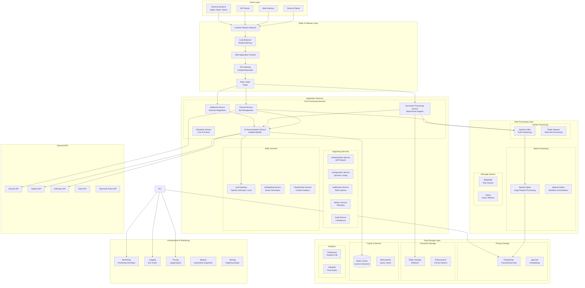
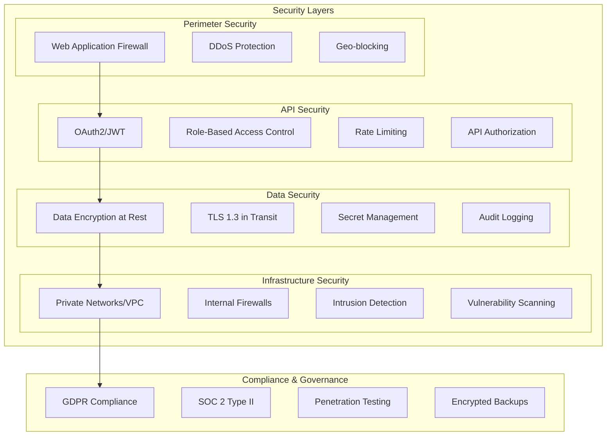

# Summary Bot NG - Enhanced System Architecture
## Scalable Document Processing & AI Summarization

### 1. Enhanced High-Level Architecture



### 2. Enhanced Service Architecture

#### 2.1 Document Processing Service (DPS)
```python
class DocumentProcessingService:
    """
    Scalable document processing supporting multiple formats:
    - Discord messages and threads
    - File attachments (PDF, DOCX, TXT, MD)
    - Web links and embeds
    - Code repositories
    """
    
    def __init__(self, config: ProcessingConfig):
        self.parsers = {
            'discord': DiscordMessageParser(),
            'pdf': PDFParser(),
            'docx': DOCXParser(),
            'markdown': MarkdownParser(),
            'code': CodeParser(),
            'web': WebContentParser()
        }
        self.preprocessors = [
            ContentNormalizer(),
            LanguageDetector(),
            SentimentAnalyzer(),
            TopicExtractor()
        ]
    
    async def process_documents(
        self, 
        documents: List[Document], 
        processing_options: ProcessingOptions
    ) -> List[ProcessedDocument]:
        """Process multiple documents with parallel processing"""
        
        # Chunk documents for parallel processing
        chunks = self._chunk_documents(documents, chunk_size=100)
        
        # Process chunks in parallel
        processed_chunks = await asyncio.gather(*[
            self._process_chunk(chunk, processing_options)
            for chunk in chunks
        ])
        
        # Flatten results
        return [doc for chunk in processed_chunks for doc in chunk]
    
    async def _process_chunk(
        self, 
        documents: List[Document], 
        options: ProcessingOptions
    ) -> List[ProcessedDocument]:
        """Process a chunk of documents"""
        results = []
        
        for doc in documents:
            try:
                # Parse document based on type
                parser = self.parsers[doc.type]
                parsed_content = await parser.parse(doc)
                
                # Apply preprocessing pipeline
                processed_content = parsed_content
                for preprocessor in self.preprocessors:
                    processed_content = await preprocessor.process(
                        processed_content, options
                    )
                
                # Create processed document
                processed_doc = ProcessedDocument(
                    original_document=doc,
                    processed_content=processed_content,
                    metadata=self._extract_metadata(doc, processed_content),
                    embeddings=await self._generate_embeddings(processed_content)
                )
                
                results.append(processed_doc)
                
            except Exception as e:
                logger.error(f"Failed to process document {doc.id}: {e}")
                # Add error document for tracking
                results.append(ProcessedDocument.create_error(doc, str(e)))
        
        return results
    
    async def _generate_embeddings(self, content: ProcessedContent) -> List[float]:
        """Generate vector embeddings for semantic search"""
        embedding_service = EmbeddingService()
        return await embedding_service.generate_embeddings(content.text)
```

#### 2.2 AI Summarization Service (Enhanced)
```python
class AIService:
    """
    Multi-model AI service supporting various providers and models
    """
    
    def __init__(self, config: AIConfig):
        self.providers = {
            'openai': OpenAIProvider(config.openai),
            'anthropic': AnthropicProvider(config.anthropic),
            'local': LocalModelProvider(config.local)
        }
        self.model_router = ModelRouter(config.routing_rules)
        self.cache = AICache(config.cache)
    
    async def summarize_documents(
        self, 
        documents: List[ProcessedDocument], 
        summary_options: SummaryOptions
    ) -> Summary:
        """Generate summary using best available model"""
        
        # Check cache first
        cache_key = self._generate_cache_key(documents, summary_options)
        cached_summary = await self.cache.get(cache_key)
        if cached_summary:
            return cached_summary
        
        # Route to best model based on content and requirements
        provider_name, model_name = await self.model_router.select_model(
            documents, summary_options
        )
        provider = self.providers[provider_name]
        
        # Prepare context
        context = await self._prepare_context(documents, summary_options)
        
        # Generate summary
        raw_summary = await provider.generate_summary(
            context, model_name, summary_options
        )
        
        # Post-process and format
        formatted_summary = await self._format_summary(
            raw_summary, summary_options
        )
        
        # Cache result
        await self.cache.set(cache_key, formatted_summary)
        
        return formatted_summary
    
    async def analyze_content(
        self, 
        documents: List[ProcessedDocument]
    ) -> ContentAnalysis:
        """Perform content analysis for insights"""
        
        analysis_tasks = [
            self._extract_topics(documents),
            self._identify_sentiment(documents),
            self._detect_key_entities(documents),
            self._find_action_items(documents),
            self._analyze_technical_content(documents)
        ]
        
        results = await asyncio.gather(*analysis_tasks)
        
        return ContentAnalysis(
            topics=results[0],
            sentiment=results[1],
            entities=results[2],
            action_items=results[3],
            technical_analysis=results[4]
        )
```

### 3. Scalability & Performance Architecture

#### 3.1 Horizontal Scaling Strategy
```python
class ScalingManager:
    """Manages horizontal scaling based on load metrics"""
    
    def __init__(self, config: ScalingConfig):
        self.metrics_collector = MetricsCollector()
        self.auto_scaler = AutoScaler(config)
        self.load_balancer = LoadBalancer(config.lb_config)
    
    async def monitor_and_scale(self):
        """Continuous monitoring and scaling"""
        while True:
            # Collect metrics
            metrics = await self.metrics_collector.collect_metrics()
            
            # Analyze scaling needs
            scaling_decision = await self.auto_scaler.analyze_metrics(metrics)
            
            if scaling_decision.action == ScalingAction.SCALE_UP:
                await self._scale_up_services(scaling_decision.services)
            elif scaling_decision.action == ScalingAction.SCALE_DOWN:
                await self._scale_down_services(scaling_decision.services)
            
            await asyncio.sleep(30)  # Check every 30 seconds
    
    async def _scale_up_services(self, services: List[str]):
        """Scale up specified services"""
        for service in services:
            await self.auto_scaler.scale_service(service, direction='up')
            await self.load_balancer.update_service_endpoints(service)
    
    async def _scale_down_services(self, services: List[str]):
        """Scale down specified services"""
        for service in services:
            await self.auto_scaler.scale_service(service, direction='down')
            await self.load_balancer.update_service_endpoints(service)
```

#### 3.2 Caching Strategy
```python
class CacheStrategy:
    """Multi-level caching for optimal performance"""
    
    def __init__(self, config: CacheConfig):
        self.l1_cache = MemoryCache(config.memory)  # In-memory
        self.l2_cache = RedisCache(config.redis)    # Redis
        self.l3_cache = DatabaseCache(config.db)    # Persistent
    
    async def get(self, key: str) -> Optional[Any]:
        """Get from multi-level cache"""
        # L1: Memory cache (fastest)
        result = await self.l1_cache.get(key)
        if result:
            return result
        
        # L2: Redis cache (fast)
        result = await self.l2_cache.get(key)
        if result:
            await self.l1_cache.set(key, result, ttl=300)  # 5 min
            return result
        
        # L3: Database cache (persistent)
        result = await self.l3_cache.get(key)
        if result:
            await self.l2_cache.set(key, result, ttl=3600)  # 1 hour
            await self.l1_cache.set(key, result, ttl=300)   # 5 min
            return result
        
        return None
    
    async def set(self, key: str, value: Any, ttl: int = 3600):
        """Set in all cache levels"""
        await asyncio.gather(
            self.l1_cache.set(key, value, ttl=min(ttl, 300)),
            self.l2_cache.set(key, value, ttl=ttl),
            self.l3_cache.set(key, value, ttl=ttl * 24)  # Longer persistence
        )
```

### 4. Data Models & Schemas

#### 4.1 Enhanced Data Models
```python
from enum import Enum
from dataclasses import dataclass, field
from typing import List, Dict, Optional, Any
from datetime import datetime

class DocumentType(Enum):
    DISCORD_MESSAGE = "discord_message"
    DISCORD_THREAD = "discord_thread"
    PDF_DOCUMENT = "pdf_document"
    WORD_DOCUMENT = "word_document"
    MARKDOWN_FILE = "markdown_file"
    CODE_REPOSITORY = "code_repository"
    WEB_CONTENT = "web_content"
    FILE_ATTACHMENT = "file_attachment"

class ProcessingStatus(Enum):
    PENDING = "pending"
    PROCESSING = "processing"
    COMPLETED = "completed"
    FAILED = "failed"
    RETRYING = "retrying"

class SummaryType(Enum):
    BRIEF = "brief"           # 1-2 paragraphs
    DETAILED = "detailed"     # 3-5 paragraphs
    COMPREHENSIVE = "comprehensive"  # Full analysis
    TECHNICAL = "technical"   # Technical focus
    EXECUTIVE = "executive"   # High-level overview

@dataclass
class Document:
    id: str
    type: DocumentType
    source_id: str  # Discord channel/message ID, file path, etc.
    title: str
    content: str
    metadata: Dict[str, Any]
    created_at: datetime
    updated_at: datetime
    size_bytes: int
    language: Optional[str] = None
    tags: List[str] = field(default_factory=list)

@dataclass
class ProcessedDocument:
    id: str
    original_document: Document
    processed_content: 'ProcessedContent'
    embeddings: List[float]
    metadata: Dict[str, Any]
    processing_status: ProcessingStatus
    processing_time_ms: int
    error_message: Optional[str] = None
    
    @classmethod
    def create_error(cls, doc: Document, error: str) -> 'ProcessedDocument':
        return cls(
            id=f"{doc.id}_error",
            original_document=doc,
            processed_content=ProcessedContent.empty(),
            embeddings=[],
            metadata={},
            processing_status=ProcessingStatus.FAILED,
            processing_time_ms=0,
            error_message=error
        )

@dataclass
class ProcessedContent:
    text: str
    summary: str
    topics: List[str]
    entities: List[str]
    key_phrases: List[str]
    sentiment_score: float
    language: str
    technical_terms: List[str]
    action_items: List[str]
    
    @classmethod
    def empty(cls) -> 'ProcessedContent':
        return cls(
            text="", summary="", topics=[], entities=[],
            key_phrases=[], sentiment_score=0.0, language="",
            technical_terms=[], action_items=[]
        )

@dataclass
class SummaryRequest:
    id: str
    user_id: str
    guild_id: Optional[str]
    document_ids: List[str]
    summary_type: SummaryType
    custom_prompt: Optional[str]
    output_format: str
    max_length: int
    include_technical_terms: bool
    include_action_items: bool
    webhook_url: Optional[str]
    created_at: datetime
    priority: int = 5  # 1-10, 10 highest

@dataclass
class Summary:
    id: str
    request_id: str
    content: str
    technical_terms: List[str]
    key_decisions: List[str]
    action_items: List[str]
    topics: List[str]
    sentiment: str
    confidence_score: float
    document_count: int
    word_count: int
    processing_time_ms: int
    model_used: str
    cost_usd: float
    created_at: datetime
    metadata: Dict[str, Any] = field(default_factory=dict)
```

### 5. Security Architecture



This enhanced architecture provides:

1. **Scalable Processing**: Multi-format document processing with parallel processing
2. **AI Flexibility**: Support for multiple AI providers and models
3. **High Performance**: Multi-level caching and horizontal scaling
4. **Security**: Comprehensive security layers and compliance
5. **Monitoring**: Full observability with metrics, logs, and tracing
6. **Reliability**: Error handling, retries, and graceful degradation

The architecture supports processing millions of messages daily while maintaining sub-second response times for cached content and under 30 seconds for complex summarization tasks.