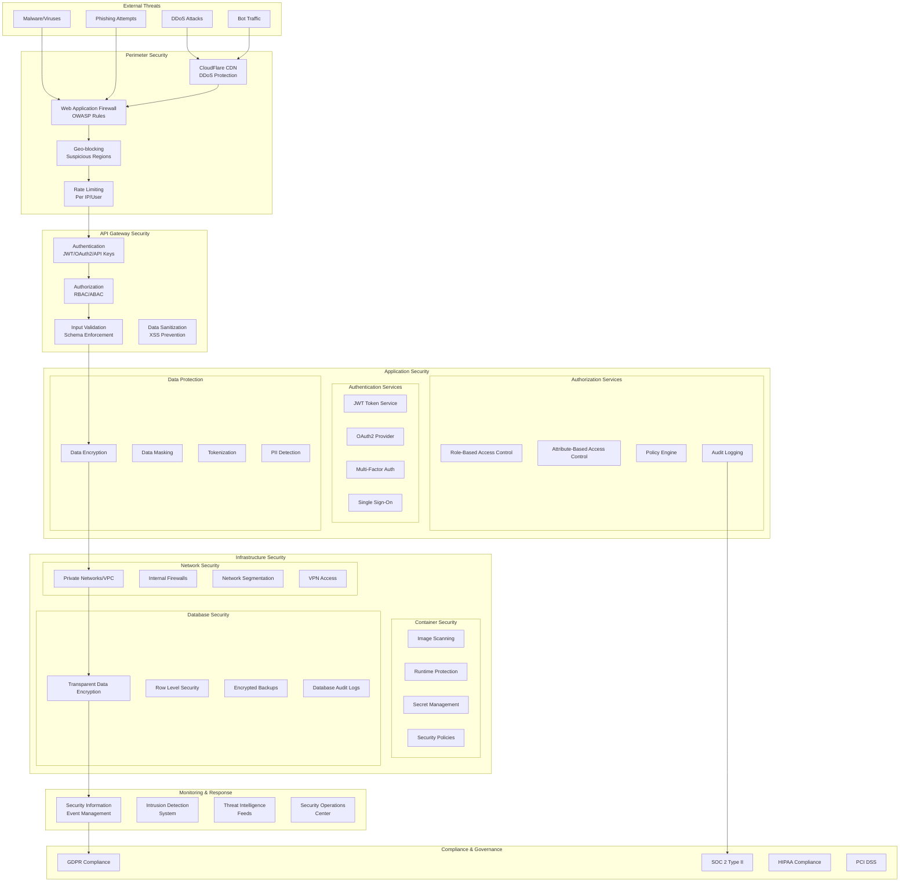

# Security Architecture - Summary Bot NG
## Comprehensive Security Framework

### 1. Security Architecture Overview



### 2. Authentication & Authorization Framework

#### 2.1 Multi-Factor Authentication System
```python
from enum import Enum
from dataclasses import dataclass
from typing import Optional, List, Dict, Any
from datetime import datetime, timedelta
import jwt
import secrets
import hashlib

class AuthenticationMethod(Enum):
    PASSWORD = "password"
    OAUTH2_DISCORD = "oauth2_discord"
    OAUTH2_GOOGLE = "oauth2_google"
    API_KEY = "api_key"
    JWT_TOKEN = "jwt_token"
    MFA_TOTP = "mfa_totp"
    MFA_SMS = "mfa_sms"
    MFA_EMAIL = "mfa_email"

class UserRole(Enum):
    ADMIN = "admin"
    MODERATOR = "moderator"
    USER = "user"
    API_CLIENT = "api_client"
    READONLY = "readonly"

class Permission(Enum):
    # Document permissions
    DOCUMENT_CREATE = "document:create"
    DOCUMENT_READ = "document:read"
    DOCUMENT_UPDATE = "document:update"
    DOCUMENT_DELETE = "document:delete"
    
    # Summary permissions
    SUMMARY_CREATE = "summary:create"
    SUMMARY_READ = "summary:read"
    SUMMARY_DELETE = "summary:delete"
    
    # Discord permissions
    DISCORD_CONNECT = "discord:connect"
    DISCORD_READ_MESSAGES = "discord:read_messages"
    DISCORD_MANAGE_CHANNELS = "discord:manage_channels"
    
    # Admin permissions
    ADMIN_USER_MANAGEMENT = "admin:user_management"
    ADMIN_SYSTEM_CONFIG = "admin:system_config"
    ADMIN_AUDIT_LOGS = "admin:audit_logs"

@dataclass
class SecurityContext:
    user_id: str
    roles: List[UserRole]
    permissions: List[Permission]
    session_id: str
    ip_address: str
    user_agent: str
    mfa_verified: bool
    token_expires_at: datetime
    rate_limit_remaining: int

class AuthenticationService:
    """Comprehensive authentication service with MFA support"""
    
    def __init__(self, config: SecurityConfig):
        self.config = config
        self.jwt_secret = config.jwt_secret
        self.token_expiry = config.token_expiry_hours
        self.mfa_enabled = config.mfa_enabled
        self.rate_limiter = RateLimiter()
        self.audit_logger = AuditLogger()
    
    async def authenticate_user(
        self, 
        credentials: Dict[str, Any], 
        method: AuthenticationMethod,
        request_context: RequestContext
    ) -> Optional[SecurityContext]:
        """Authenticate user with specified method"""
        
        # Check rate limiting
        if not await self.rate_limiter.check_auth_attempts(
            request_context.ip_address
        ):
            await self.audit_logger.log_security_event(
                "RATE_LIMIT_EXCEEDED", 
                request_context
            )
            raise RateLimitExceededException()
        
        try:
            # Authenticate based on method
            user = None
            if method == AuthenticationMethod.PASSWORD:
                user = await self._authenticate_password(credentials)
            elif method == AuthenticationMethod.OAUTH2_DISCORD:
                user = await self._authenticate_oauth2(credentials, "discord")
            elif method == AuthenticationMethod.API_KEY:
                user = await self._authenticate_api_key(credentials)
            elif method == AuthenticationMethod.JWT_TOKEN:
                user = await self._authenticate_jwt(credentials["token"])
            
            if not user:
                await self.audit_logger.log_security_event(
                    "AUTHENTICATION_FAILED", 
                    request_context,
                    {"method": method.value}
                )
                return None
            
            # Check if MFA is required
            if self.mfa_enabled and user.mfa_required:
                mfa_token = credentials.get("mfa_token")
                if not mfa_token or not await self._verify_mfa(user.id, mfa_token):
                    await self.audit_logger.log_security_event(
                        "MFA_VERIFICATION_FAILED",
                        request_context,
                        {"user_id": user.id}
                    )
                    raise MFARequiredException()
            
            # Create security context
            security_context = SecurityContext(
                user_id=user.id,
                roles=user.roles,
                permissions=await self._get_user_permissions(user),
                session_id=secrets.token_urlsafe(32),
                ip_address=request_context.ip_address,
                user_agent=request_context.user_agent,
                mfa_verified=self.mfa_enabled and user.mfa_required,
                token_expires_at=datetime.utcnow() + timedelta(hours=self.token_expiry),
                rate_limit_remaining=await self.rate_limiter.get_remaining(user.id)
            )
            
            await self.audit_logger.log_security_event(
                "AUTHENTICATION_SUCCESS",
                request_context,
                {
                    "user_id": user.id,
                    "method": method.value,
                    "session_id": security_context.session_id
                }
            )
            
            return security_context
            
        except Exception as e:
            await self.audit_logger.log_security_event(
                "AUTHENTICATION_ERROR",
                request_context,
                {"error": str(e), "method": method.value}
            )
            raise

    async def _authenticate_password(self, credentials: Dict[str, Any]) -> Optional[User]:
        """Authenticate with username/password"""
        username = credentials.get("username")
        password = credentials.get("password")
        
        if not username or not password:
            return None
        
        user = await self.user_repository.get_by_username(username)
        if not user or not user.active:
            return None
        
        # Check password
        password_hash = self._hash_password(password, user.salt)
        if not secrets.compare_digest(password_hash, user.password_hash):
            return None
        
        # Check account lockout
        if user.locked_until and user.locked_until > datetime.utcnow():
            raise AccountLockedException(user.locked_until)
        
        return user

    async def _authenticate_oauth2(self, credentials: Dict[str, Any], provider: str) -> Optional[User]:
        """Authenticate with OAuth2 provider"""
        access_token = credentials.get("access_token")
        if not access_token:
            return None
        
        # Verify token with provider
        oauth_client = self.oauth_clients[provider]
        user_info = await oauth_client.get_user_info(access_token)
        
        if not user_info:
            return None
        
        # Get or create user
        user = await self.user_repository.get_by_oauth_id(
            provider, user_info["id"]
        )
        
        if not user:
            # Create new user from OAuth info
            user = await self._create_oauth_user(provider, user_info)
        
        return user

    async def _verify_mfa(self, user_id: str, mfa_token: str) -> bool:
        """Verify MFA token"""
        user = await self.user_repository.get_by_id(user_id)
        if not user or not user.mfa_secret:
            return False
        
        # Verify TOTP token
        totp = TOTP(user.mfa_secret)
        return totp.verify(mfa_token, valid_window=1)

    def _hash_password(self, password: str, salt: str) -> str:
        """Hash password with salt using PBKDF2"""
        return hashlib.pbkdf2_hmac(
            'sha256',
            password.encode('utf-8'),
            salt.encode('utf-8'),
            100000  # 100k iterations
        ).hex()

class AuthorizationService:
    """Role-based and attribute-based access control"""
    
    def __init__(self, config: SecurityConfig):
        self.config = config
        self.policy_engine = PolicyEngine()
        self.audit_logger = AuditLogger()
    
    async def check_permission(
        self, 
        security_context: SecurityContext, 
        permission: Permission,
        resource: Optional[Dict[str, Any]] = None
    ) -> bool:
        """Check if user has permission for resource"""
        
        try:
            # Check role-based permissions
            if permission in security_context.permissions:
                rbac_allowed = True
            else:
                rbac_allowed = False
            
            # Check attribute-based permissions if resource provided
            abac_allowed = True
            if resource:
                abac_allowed = await self.policy_engine.evaluate(
                    security_context, permission, resource
                )
            
            allowed = rbac_allowed and abac_allowed
            
            # Log authorization decision
            await self.audit_logger.log_authorization_event(
                security_context.user_id,
                permission.value,
                resource,
                allowed
            )
            
            return allowed
            
        except Exception as e:
            await self.audit_logger.log_security_event(
                "AUTHORIZATION_ERROR",
                {"user_id": security_context.user_id},
                {"error": str(e), "permission": permission.value}
            )
            return False

    async def get_accessible_resources(
        self, 
        security_context: SecurityContext,
        resource_type: str
    ) -> List[str]:
        """Get list of resources user can access"""
        
        if UserRole.ADMIN in security_context.roles:
            # Admins can access all resources
            return await self._get_all_resources(resource_type)
        
        # Get user-specific resources based on permissions
        accessible_resources = []
        
        for resource_id in await self._get_all_resources(resource_type):
            resource = await self._get_resource(resource_type, resource_id)
            
            if await self.check_permission(
                security_context, 
                Permission.DOCUMENT_READ,  # Adjust based on resource type
                resource
            ):
                accessible_resources.append(resource_id)
        
        return accessible_resources
```

#### 2.2 JWT Token Management
```python
class JWTTokenService:
    """Secure JWT token management with refresh tokens"""
    
    def __init__(self, config: JWTConfig):
        self.secret_key = config.secret_key
        self.algorithm = config.algorithm  # HS256, RS256, etc.
        self.access_token_expiry = config.access_token_expiry_minutes
        self.refresh_token_expiry = config.refresh_token_expiry_days
        self.redis_client = redis.Redis(config.redis_url)
    
    async def create_token_pair(
        self, 
        security_context: SecurityContext
    ) -> Dict[str, str]:
        """Create access and refresh token pair"""
        
        # Create access token
        access_payload = {
            "user_id": security_context.user_id,
            "session_id": security_context.session_id,
            "roles": [role.value for role in security_context.roles],
            "permissions": [perm.value for perm in security_context.permissions],
            "mfa_verified": security_context.mfa_verified,
            "exp": datetime.utcnow() + timedelta(minutes=self.access_token_expiry),
            "iat": datetime.utcnow(),
            "type": "access"
        }
        
        access_token = jwt.encode(access_payload, self.secret_key, self.algorithm)
        
        # Create refresh token
        refresh_payload = {
            "user_id": security_context.user_id,
            "session_id": security_context.session_id,
            "exp": datetime.utcnow() + timedelta(days=self.refresh_token_expiry),
            "iat": datetime.utcnow(),
            "type": "refresh"
        }
        
        refresh_token = jwt.encode(refresh_payload, self.secret_key, self.algorithm)
        
        # Store refresh token in Redis
        await self.redis_client.setex(
            f"refresh_token:{refresh_token}",
            self.refresh_token_expiry * 24 * 60 * 60,  # Convert to seconds
            security_context.user_id
        )
        
        return {
            "access_token": access_token,
            "refresh_token": refresh_token,
            "expires_in": self.access_token_expiry * 60  # Convert to seconds
        }
    
    async def refresh_access_token(self, refresh_token: str) -> Optional[str]:
        """Refresh access token using refresh token"""
        
        try:
            # Verify refresh token
            payload = jwt.decode(refresh_token, self.secret_key, [self.algorithm])
            
            if payload.get("type") != "refresh":
                return None
            
            # Check if refresh token exists in Redis
            stored_user_id = await self.redis_client.get(
                f"refresh_token:{refresh_token}"
            )
            
            if not stored_user_id or stored_user_id.decode() != payload["user_id"]:
                return None
            
            # Get current user context
            user = await self.user_repository.get_by_id(payload["user_id"])
            if not user or not user.active:
                return None
            
            # Create new access token
            security_context = await self._create_security_context(user, payload["session_id"])
            tokens = await self.create_token_pair(security_context)
            
            return tokens["access_token"]
            
        except jwt.InvalidTokenError:
            return None
    
    async def revoke_token(self, token: str):
        """Revoke token by adding to blacklist"""
        
        try:
            payload = jwt.decode(
                token, 
                self.secret_key, 
                [self.algorithm], 
                options={"verify_exp": False}
            )
            
            # Add token to blacklist
            exp = payload.get("exp", 0)
            ttl = max(0, exp - int(datetime.utcnow().timestamp()))
            
            await self.redis_client.setex(
                f"blacklist:{token}",
                ttl,
                "revoked"
            )
            
        except jwt.InvalidTokenError:
            pass  # Invalid token, nothing to revoke
```

### 3. Data Protection & Privacy

#### 3.1 Data Encryption Framework
```python
from cryptography.fernet import Fernet
from cryptography.hazmat.primitives import hashes
from cryptography.hazmat.primitives.kdf.pbkdf2 import PBKDF2HMAC
import base64
import os

class EncryptionService:
    """Comprehensive data encryption service"""
    
    def __init__(self, config: EncryptionConfig):
        self.config = config
        self.fernet = Fernet(config.encryption_key)
        self.field_encryption_keys = {}
        
        # Initialize field-level encryption keys
        for field_name, key in config.field_encryption_keys.items():
            self.field_encryption_keys[field_name] = Fernet(key)
    
    async def encrypt_sensitive_data(
        self, 
        data: Dict[str, Any], 
        sensitivity_rules: Dict[str, str]
    ) -> Dict[str, Any]:
        """Encrypt data based on sensitivity rules"""
        
        encrypted_data = data.copy()
        
        for field_name, sensitivity_level in sensitivity_rules.items():
            if field_name in encrypted_data:
                if sensitivity_level == "PII":
                    encrypted_data[field_name] = await self._encrypt_pii(
                        encrypted_data[field_name]
                    )
                elif sensitivity_level == "SENSITIVE":
                    encrypted_data[field_name] = await self._encrypt_sensitive(
                        encrypted_data[field_name]
                    )
                elif sensitivity_level == "CONFIDENTIAL":
                    encrypted_data[field_name] = await self._encrypt_confidential(
                        encrypted_data[field_name]
                    )
        
        return encrypted_data
    
    async def decrypt_sensitive_data(
        self, 
        encrypted_data: Dict[str, Any], 
        user_context: SecurityContext
    ) -> Dict[str, Any]:
        """Decrypt data based on user permissions"""
        
        decrypted_data = encrypted_data.copy()
        
        # Check if user has permission to decrypt sensitive data
        if not await self._can_decrypt_sensitive_data(user_context):
            # Return masked data for unauthorized users
            return await self._mask_sensitive_fields(encrypted_data)
        
        for field_name, encrypted_value in encrypted_data.items():
            if self._is_encrypted_field(field_name, encrypted_value):
                try:
                    decrypted_data[field_name] = await self._decrypt_field(
                        field_name, encrypted_value
                    )
                except Exception:
                    # If decryption fails, mask the field
                    decrypted_data[field_name] = "[ENCRYPTED]"
        
        return decrypted_data
    
    async def _encrypt_pii(self, data: str) -> str:
        """Encrypt PII data with strongest encryption"""
        pii_key = self.field_encryption_keys.get("pii", self.fernet)
        return pii_key.encrypt(data.encode()).decode()
    
    async def _encrypt_sensitive(self, data: str) -> str:
        """Encrypt sensitive data"""
        sensitive_key = self.field_encryption_keys.get("sensitive", self.fernet)
        return sensitive_key.encrypt(data.encode()).decode()
    
    async def _encrypt_confidential(self, data: str) -> str:
        """Encrypt confidential data"""
        confidential_key = self.field_encryption_keys.get("confidential", self.fernet)
        return confidential_key.encrypt(data.encode()).decode()

class PIIDetectionService:
    """Detect and classify PII in content"""
    
    def __init__(self):
        self.pii_patterns = {
            "email": r'\b[A-Za-z0-9._%+-]+@[A-Za-z0-9.-]+\.[A-Z|a-z]{2,}\b',
            "phone": r'\b(?:\+?1[-.\s]?)?\(?([0-9]{3})\)?[-.\s]?([0-9]{3})[-.\s]?([0-9]{4})\b',
            "ssn": r'\b(?!000|666|9\d{2})\d{3}[-.]?(?!00)\d{2}[-.]?(?!0000)\d{4}\b',
            "credit_card": r'\b(?:4[0-9]{12}(?:[0-9]{3})?|5[1-5][0-9]{14}|3[47][0-9]{13}|3[0-9]{13}|6(?:011|5[0-9]{2})[0-9]{12})\b',
            "ip_address": r'\b(?:[0-9]{1,3}\.){3}[0-9]{1,3}\b',
            "discord_id": r'\b\d{17,19}\b'
        }
    
    async def detect_pii(self, content: str) -> Dict[str, List[str]]:
        """Detect PII in content"""
        import re
        
        detected_pii = {}
        
        for pii_type, pattern in self.pii_patterns.items():
            matches = re.findall(pattern, content, re.IGNORECASE)
            if matches:
                detected_pii[pii_type] = matches
        
        return detected_pii
    
    async def sanitize_content(self, content: str) -> str:
        """Remove or mask PII from content"""
        import re
        
        sanitized_content = content
        
        for pii_type, pattern in self.pii_patterns.items():
            mask = self._get_mask_for_type(pii_type)
            sanitized_content = re.sub(pattern, mask, sanitized_content, flags=re.IGNORECASE)
        
        return sanitized_content
    
    def _get_mask_for_type(self, pii_type: str) -> str:
        """Get appropriate mask for PII type"""
        masks = {
            "email": "[EMAIL]",
            "phone": "[PHONE]",
            "ssn": "[SSN]",
            "credit_card": "[CREDIT_CARD]",
            "ip_address": "[IP_ADDRESS]",
            "discord_id": "[DISCORD_ID]"
        }
        return masks.get(pii_type, "[PII]")
```

### 4. Security Monitoring & Incident Response

#### 4.1 Security Event Monitoring
```python
class SecurityEventMonitor:
    """Real-time security event monitoring and alerting"""
    
    def __init__(self, config: MonitoringConfig):
        self.config = config
        self.event_store = EventStore()
        self.alert_manager = AlertManager()
        self.threat_intelligence = ThreatIntelligence()
        
        # Security event thresholds
        self.thresholds = {
            "failed_logins_per_ip": 10,
            "failed_logins_per_user": 5,
            "unusual_access_pattern": 0.8,  # Confidence score
            "data_exfiltration_bytes": 100 * 1024 * 1024,  # 100MB
            "api_rate_limit_violations": 50,
            "privilege_escalation_attempts": 1
        }
    
    async def process_security_event(self, event: SecurityEvent):
        """Process incoming security event"""
        
        # Store event
        await self.event_store.store(event)
        
        # Analyze event for threats
        threat_analysis = await self._analyze_threat(event)
        
        if threat_analysis.risk_level >= RiskLevel.MEDIUM:
            # Create security incident
            incident = await self._create_incident(event, threat_analysis)
            
            # Send alerts
            await self.alert_manager.send_alert(incident)
            
            # Auto-respond if configured
            if threat_analysis.auto_response_enabled:
                await self._auto_respond(incident)
    
    async def _analyze_threat(self, event: SecurityEvent) -> ThreatAnalysis:
        """Analyze security event for threats"""
        
        analysis = ThreatAnalysis(
            event_id=event.id,
            risk_level=RiskLevel.LOW,
            confidence=0.0,
            indicators=[],
            recommendations=[]
        )
        
        # Check for known attack patterns
        if event.event_type == "AUTHENTICATION_FAILED":
            analysis = await self._analyze_failed_authentication(event)
        elif event.event_type == "UNUSUAL_ACCESS_PATTERN":
            analysis = await self._analyze_access_pattern(event)
        elif event.event_type == "DATA_ACCESS_ANOMALY":
            analysis = await self._analyze_data_access(event)
        elif event.event_type == "API_ABUSE":
            analysis = await self._analyze_api_abuse(event)
        
        # Enrich with threat intelligence
        await self._enrich_with_threat_intelligence(analysis)
        
        return analysis
    
    async def _analyze_failed_authentication(self, event: SecurityEvent) -> ThreatAnalysis:
        """Analyze failed authentication attempts"""
        
        # Count recent failed attempts from same IP
        ip_failures = await self.event_store.count_events(
            event_type="AUTHENTICATION_FAILED",
            ip_address=event.ip_address,
            time_window=timedelta(minutes=15)
        )
        
        # Count recent failed attempts for same user
        user_failures = await self.event_store.count_events(
            event_type="AUTHENTICATION_FAILED",
            user_id=event.user_id,
            time_window=timedelta(minutes=30)
        )
        
        risk_level = RiskLevel.LOW
        confidence = 0.1
        indicators = []
        
        if ip_failures > self.thresholds["failed_logins_per_ip"]:
            risk_level = RiskLevel.HIGH
            confidence = 0.9
            indicators.append("Brute force attack from IP")
        
        if user_failures > self.thresholds["failed_logins_per_user"]:
            risk_level = max(risk_level, RiskLevel.MEDIUM)
            confidence = max(confidence, 0.7)
            indicators.append("Credential stuffing attack")
        
        return ThreatAnalysis(
            event_id=event.id,
            risk_level=risk_level,
            confidence=confidence,
            indicators=indicators,
            recommendations=self._get_auth_failure_recommendations(risk_level)
        )
    
    async def _auto_respond(self, incident: SecurityIncident):
        """Automated incident response"""
        
        if incident.risk_level == RiskLevel.HIGH:
            # Block IP address
            if incident.source_ip:
                await self._block_ip_address(incident.source_ip, duration="1h")
            
            # Disable user account if compromised
            if incident.user_id and incident.incident_type == "ACCOUNT_COMPROMISE":
                await self._disable_user_account(incident.user_id)
            
            # Rate limit API keys
            if incident.incident_type == "API_ABUSE":
                await self._rate_limit_api_key(incident.api_key, strict=True)
        
        elif incident.risk_level == RiskLevel.MEDIUM:
            # Increase monitoring
            await self._increase_monitoring(incident.source_ip, incident.user_id)
            
            # Require MFA for user
            if incident.user_id:
                await self._require_mfa(incident.user_id)

class ComplianceManager:
    """Manage compliance with security standards"""
    
    def __init__(self, config: ComplianceConfig):
        self.config = config
        self.audit_logger = AuditLogger()
        self.report_generator = ComplianceReportGenerator()
    
    async def ensure_gdpr_compliance(self, user_request: DataRequest):
        """Handle GDPR data requests"""
        
        if user_request.request_type == "DATA_EXPORT":
            # Generate user data export
            user_data = await self._collect_user_data(user_request.user_id)
            
            # Encrypt export file
            encrypted_export = await self._encrypt_export(user_data)
            
            # Log compliance action
            await self.audit_logger.log_compliance_event(
                "GDPR_DATA_EXPORT",
                user_request.user_id,
                {"export_size": len(encrypted_export)}
            )
            
            return encrypted_export
        
        elif user_request.request_type == "DATA_DELETION":
            # Delete user data
            await self._delete_user_data(user_request.user_id)
            
            # Log compliance action
            await self.audit_logger.log_compliance_event(
                "GDPR_DATA_DELETION",
                user_request.user_id,
                {"deletion_timestamp": datetime.utcnow()}
            )
    
    async def generate_soc2_report(self) -> ComplianceReport:
        """Generate SOC 2 Type II compliance report"""
        
        # Collect security controls evidence
        controls_evidence = await self._collect_controls_evidence()
        
        # Generate report
        report = await self.report_generator.generate_soc2_report(
            controls_evidence,
            reporting_period=self.config.reporting_period
        )
        
        return report
```

This comprehensive security architecture provides:

1. **Multi-layered Defense**: From perimeter to application to data layer
2. **Zero Trust Architecture**: Verify everything, trust nothing
3. **Comprehensive Authentication**: Multiple auth methods with MFA
4. **Fine-grained Authorization**: RBAC and ABAC with policy engine
5. **Data Protection**: Encryption at rest and in transit, PII detection
6. **Real-time Monitoring**: Security event detection and automated response
7. **Compliance Framework**: GDPR, SOC 2, and other standards
8. **Incident Response**: Automated threat detection and response

The architecture ensures enterprise-grade security while maintaining performance and usability.