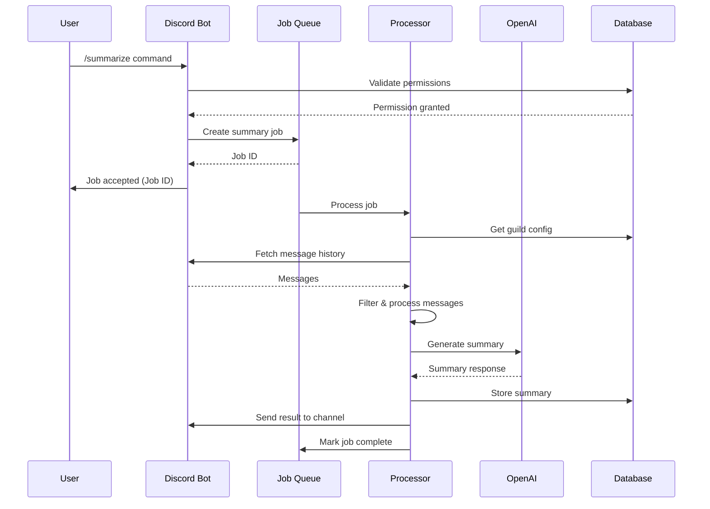
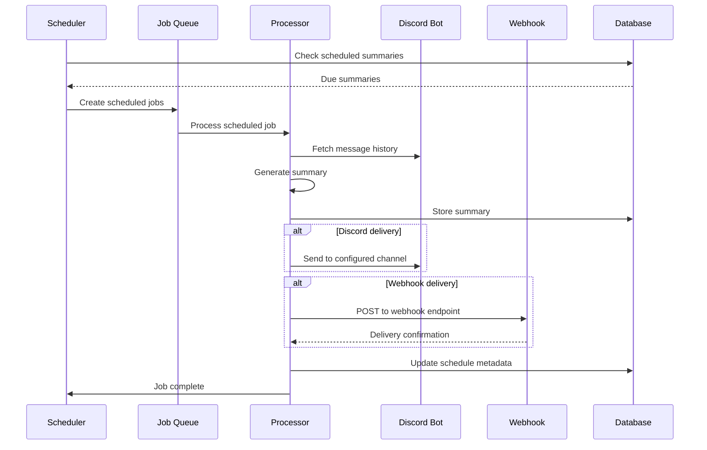
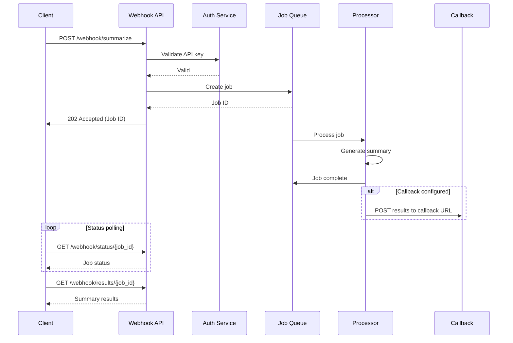
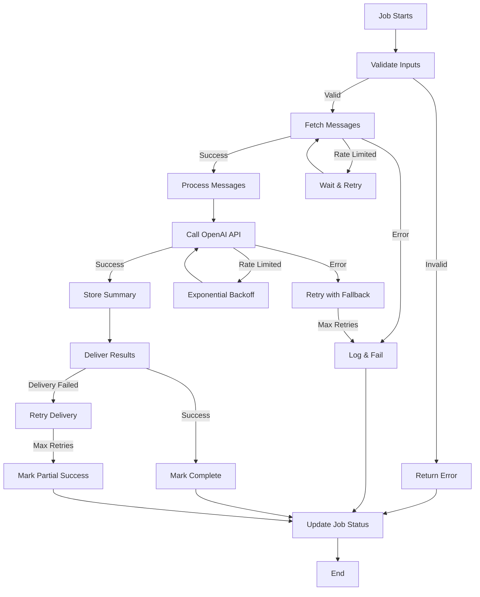

# Data Models and Message Flow Specifications
## Summary Bot NG - Data Architecture & Processing Flow

### 1. Data Models

#### 1.1 Core Domain Models

##### 1.1.1 Summary Model

```python
from dataclasses import dataclass
from datetime import datetime
from typing import List, Optional, Dict, Any
from enum import Enum

class SummaryFormat(Enum):
    BRIEF = "brief"
    STRUCTURED = "structured"
    DETAILED = "detailed"
    TECHNICAL = "technical"

class SummaryStatus(Enum):
    PENDING = "pending"
    PROCESSING = "processing"
    COMPLETED = "completed"
    FAILED = "failed"
    CANCELLED = "cancelled"

@dataclass
class Summary:
    """Core summary entity"""
    id: str
    guild_id: str
    channel_id: str
    thread_id: Optional[str]
    job_id: str
    status: SummaryStatus
    format: SummaryFormat
    
    # Content
    overview: Optional[str]
    key_points: List[str]
    decisions: List[str]
    action_items: List[str]
    technical_details: Optional[str]
    
    # Metadata
    message_count: int
    participant_count: int
    time_range_start: datetime
    time_range_end: datetime
    created_at: datetime
    updated_at: datetime
    completed_at: Optional[datetime]
    
    # Processing info
    processing_time_seconds: Optional[float]
    openai_tokens_used: Optional[int]
    error_message: Optional[str]
    
    # Links and references
    source_message_links: List[str]
    generated_by: str  # user_id or 'system'
```

##### 1.1.2 Discord Message Models

```python
@dataclass
class DiscordUser:
    """Discord user representation"""
    id: str
    username: str
    display_name: Optional[str]
    bot: bool = False
    system: bool = False

@dataclass
class DiscordChannel:
    """Discord channel representation"""
    id: str
    name: str
    type: str  # text, voice, thread, etc.
    guild_id: str
    parent_id: Optional[str]  # for threads

@dataclass
class DiscordMessage:
    """Discord message representation"""
    id: str
    channel_id: str
    guild_id: str
    author: DiscordUser
    content: str
    timestamp: datetime
    edited_timestamp: Optional[datetime]
    
    # Message metadata
    message_type: str
    pinned: bool
    mentions: List[DiscordUser]
    mention_roles: List[str]
    mention_everyone: bool
    
    # Attachments and embeds
    attachments: List[Dict[str, Any]]
    embeds: List[Dict[str, Any]]
    
    # Thread information
    thread_id: Optional[str]
    reference_message_id: Optional[str]  # for replies
    
    # Reactions
    reactions: List[Dict[str, Any]]
    
    def is_bot_message(self) -> bool:
        return self.author.bot
    
    def is_system_message(self) -> bool:
        return self.author.system or self.message_type != "default"
    
    def has_content(self) -> bool:
        return bool(self.content.strip() or self.attachments or self.embeds)
```

##### 1.1.3 Configuration Models

```python
@dataclass
class GuildConfiguration:
    """Server-specific configuration"""
    guild_id: str
    
    # Default settings
    default_format: SummaryFormat
    default_hours: int
    max_hours_limit: int
    
    # Channel management
    excluded_channels: List[str]
    included_channels: List[str]  # if specified, only these are allowed
    auto_delete_hours: Optional[int]
    
    # Permissions
    allowed_roles: List[str]
    admin_roles: List[str]
    
    # Scheduling
    scheduled_summaries: List['ScheduledSummary']
    
    # Webhook settings
    webhook_enabled: bool
    webhook_destinations: List['WebhookDestination']
    
    created_at: datetime
    updated_at: datetime

@dataclass
class ScheduledSummary:
    """Scheduled summarization configuration"""
    id: str
    guild_id: str
    channel_id: str
    
    # Schedule configuration
    cron_expression: str
    timezone: str
    enabled: bool
    
    # Summary settings
    format: SummaryFormat
    hours_back: int
    
    # Delivery settings
    destination_channel_id: Optional[str]
    webhook_destinations: List[str]
    
    # Metadata
    last_run: Optional[datetime]
    next_run: datetime
    run_count: int
    failure_count: int
    
    created_at: datetime
    updated_at: datetime

@dataclass
class WebhookDestination:
    """External webhook destination"""
    id: str
    name: str
    url: str
    headers: Dict[str, str]
    
    # Configuration
    enabled: bool
    retry_count: int
    timeout_seconds: int
    
    # Authentication
    auth_type: str  # bearer, basic, custom
    auth_config: Dict[str, str]
    
    # Statistics
    success_count: int
    failure_count: int
    last_success: Optional[datetime]
    last_failure: Optional[datetime]
```

##### 1.1.4 Job Processing Models

```python
@dataclass
class SummaryJob:
    """Processing job representation"""
    id: str
    type: str  # manual, scheduled, webhook
    status: SummaryStatus
    priority: int  # 1-10, higher is more important
    
    # Request details
    requester_id: str  # user_id or 'system'
    guild_id: str
    channel_id: str
    thread_id: Optional[str]
    
    # Parameters
    time_range_start: datetime
    time_range_end: datetime
    format: SummaryFormat
    options: Dict[str, Any]
    
    # Processing state
    created_at: datetime
    started_at: Optional[datetime]
    completed_at: Optional[datetime]
    estimated_completion: Optional[datetime]
    
    # Progress tracking
    total_steps: int
    current_step: int
    step_description: str
    
    # Results
    result_summary_id: Optional[str]
    error_details: Optional[str]
    
    # Delivery
    delivery_config: Optional[Dict[str, Any]]
    delivery_attempts: int
    delivered: bool

@dataclass
class ProcessingMetrics:
    """Job processing metrics"""
    job_id: str
    
    # Timing metrics
    queue_time_seconds: float
    processing_time_seconds: float
    total_time_seconds: float
    
    # Resource usage
    messages_processed: int
    api_calls_made: int
    tokens_consumed: int
    memory_peak_mb: float
    
    # Quality metrics
    summary_length_chars: int
    compression_ratio: float  # original_length / summary_length
    
    # API metrics
    openai_response_time: float
    discord_api_calls: int
    discord_rate_limits_hit: int
    
    timestamp: datetime
```

#### 1.2 Database Schema

##### 1.2.1 SQLite Schema (Development)

```sql
-- Summaries table
CREATE TABLE summaries (
    id TEXT PRIMARY KEY,
    guild_id TEXT NOT NULL,
    channel_id TEXT NOT NULL,
    thread_id TEXT,
    job_id TEXT UNIQUE NOT NULL,
    status TEXT NOT NULL CHECK(status IN ('pending', 'processing', 'completed', 'failed', 'cancelled')),
    format TEXT NOT NULL CHECK(format IN ('brief', 'structured', 'detailed', 'technical')),
    
    -- Content (stored as JSON)
    overview TEXT,
    key_points JSON,
    decisions JSON,
    action_items JSON,
    technical_details TEXT,
    
    -- Metadata
    message_count INTEGER NOT NULL DEFAULT 0,
    participant_count INTEGER NOT NULL DEFAULT 0,
    time_range_start DATETIME NOT NULL,
    time_range_end DATETIME NOT NULL,
    created_at DATETIME NOT NULL DEFAULT CURRENT_TIMESTAMP,
    updated_at DATETIME NOT NULL DEFAULT CURRENT_TIMESTAMP,
    completed_at DATETIME,
    
    -- Processing info
    processing_time_seconds REAL,
    openai_tokens_used INTEGER,
    error_message TEXT,
    
    -- References
    source_message_links JSON,
    generated_by TEXT NOT NULL
);

-- Jobs table
CREATE TABLE summary_jobs (
    id TEXT PRIMARY KEY,
    type TEXT NOT NULL CHECK(type IN ('manual', 'scheduled', 'webhook')),
    status TEXT NOT NULL CHECK(status IN ('pending', 'processing', 'completed', 'failed', 'cancelled')),
    priority INTEGER NOT NULL DEFAULT 5,
    
    -- Request details
    requester_id TEXT NOT NULL,
    guild_id TEXT NOT NULL,
    channel_id TEXT NOT NULL,
    thread_id TEXT,
    
    -- Parameters (stored as JSON)
    time_range_start DATETIME NOT NULL,
    time_range_end DATETIME NOT NULL,
    format TEXT NOT NULL,
    options JSON,
    
    -- Processing state
    created_at DATETIME NOT NULL DEFAULT CURRENT_TIMESTAMP,
    started_at DATETIME,
    completed_at DATETIME,
    estimated_completion DATETIME,
    
    -- Progress
    total_steps INTEGER NOT NULL DEFAULT 1,
    current_step INTEGER NOT NULL DEFAULT 0,
    step_description TEXT,
    
    -- Results
    result_summary_id TEXT,
    error_details TEXT,
    
    -- Delivery
    delivery_config JSON,
    delivery_attempts INTEGER NOT NULL DEFAULT 0,
    delivered BOOLEAN NOT NULL DEFAULT FALSE,
    
    FOREIGN KEY (result_summary_id) REFERENCES summaries(id)
);

-- Guild configurations
CREATE TABLE guild_configurations (
    guild_id TEXT PRIMARY KEY,
    
    -- Default settings
    default_format TEXT NOT NULL DEFAULT 'structured',
    default_hours INTEGER NOT NULL DEFAULT 24,
    max_hours_limit INTEGER NOT NULL DEFAULT 168,
    
    -- Channel management (stored as JSON arrays)
    excluded_channels JSON,
    included_channels JSON,
    auto_delete_hours INTEGER,
    
    -- Permissions
    allowed_roles JSON,
    admin_roles JSON,
    
    -- Webhook settings
    webhook_enabled BOOLEAN NOT NULL DEFAULT FALSE,
    
    created_at DATETIME NOT NULL DEFAULT CURRENT_TIMESTAMP,
    updated_at DATETIME NOT NULL DEFAULT CURRENT_TIMESTAMP
);

-- Scheduled summaries
CREATE TABLE scheduled_summaries (
    id TEXT PRIMARY KEY,
    guild_id TEXT NOT NULL,
    channel_id TEXT NOT NULL,
    
    -- Schedule
    cron_expression TEXT NOT NULL,
    timezone TEXT NOT NULL DEFAULT 'UTC',
    enabled BOOLEAN NOT NULL DEFAULT TRUE,
    
    -- Summary settings
    format TEXT NOT NULL DEFAULT 'structured',
    hours_back INTEGER NOT NULL DEFAULT 24,
    
    -- Delivery
    destination_channel_id TEXT,
    webhook_destinations JSON,
    
    -- Metadata
    last_run DATETIME,
    next_run DATETIME NOT NULL,
    run_count INTEGER NOT NULL DEFAULT 0,
    failure_count INTEGER NOT NULL DEFAULT 0,
    
    created_at DATETIME NOT NULL DEFAULT CURRENT_TIMESTAMP,
    updated_at DATETIME NOT NULL DEFAULT CURRENT_TIMESTAMP,
    
    FOREIGN KEY (guild_id) REFERENCES guild_configurations(guild_id)
);

-- Processing metrics
CREATE TABLE processing_metrics (
    job_id TEXT PRIMARY KEY,
    
    -- Timing
    queue_time_seconds REAL NOT NULL,
    processing_time_seconds REAL NOT NULL,
    total_time_seconds REAL NOT NULL,
    
    -- Resources
    messages_processed INTEGER NOT NULL,
    api_calls_made INTEGER NOT NULL,
    tokens_consumed INTEGER NOT NULL,
    memory_peak_mb REAL NOT NULL,
    
    -- Quality
    summary_length_chars INTEGER NOT NULL,
    compression_ratio REAL NOT NULL,
    
    -- API metrics
    openai_response_time REAL NOT NULL,
    discord_api_calls INTEGER NOT NULL,
    discord_rate_limits_hit INTEGER NOT NULL DEFAULT 0,
    
    timestamp DATETIME NOT NULL DEFAULT CURRENT_TIMESTAMP,
    
    FOREIGN KEY (job_id) REFERENCES summary_jobs(id)
);

-- Webhook destinations
CREATE TABLE webhook_destinations (
    id TEXT PRIMARY KEY,
    guild_id TEXT NOT NULL,
    name TEXT NOT NULL,
    url TEXT NOT NULL,
    headers JSON,
    
    -- Configuration
    enabled BOOLEAN NOT NULL DEFAULT TRUE,
    retry_count INTEGER NOT NULL DEFAULT 3,
    timeout_seconds INTEGER NOT NULL DEFAULT 30,
    
    -- Authentication
    auth_type TEXT NOT NULL DEFAULT 'none',
    auth_config JSON,
    
    -- Statistics
    success_count INTEGER NOT NULL DEFAULT 0,
    failure_count INTEGER NOT NULL DEFAULT 0,
    last_success DATETIME,
    last_failure DATETIME,
    
    created_at DATETIME NOT NULL DEFAULT CURRENT_TIMESTAMP,
    updated_at DATETIME NOT NULL DEFAULT CURRENT_TIMESTAMP,
    
    FOREIGN KEY (guild_id) REFERENCES guild_configurations(guild_id)
);

-- Indexes for performance
CREATE INDEX idx_summaries_guild_channel ON summaries(guild_id, channel_id);
CREATE INDEX idx_summaries_created_at ON summaries(created_at);
CREATE INDEX idx_summaries_status ON summaries(status);

CREATE INDEX idx_jobs_status ON summary_jobs(status);
CREATE INDEX idx_jobs_priority ON summary_jobs(priority DESC);
CREATE INDEX idx_jobs_created_at ON summary_jobs(created_at);
CREATE INDEX idx_jobs_guild_channel ON summary_jobs(guild_id, channel_id);

CREATE INDEX idx_scheduled_next_run ON scheduled_summaries(next_run, enabled);
CREATE INDEX idx_scheduled_guild ON scheduled_summaries(guild_id);

CREATE INDEX idx_metrics_timestamp ON processing_metrics(timestamp);
```

##### 1.2.2 PostgreSQL Schema (Production)

```sql
-- Enable UUID extension
CREATE EXTENSION IF NOT EXISTS "uuid-ossp";

-- Use similar tables with UUID primary keys and additional constraints
CREATE TABLE summaries (
    id UUID PRIMARY KEY DEFAULT uuid_generate_v4(),
    guild_id VARCHAR(20) NOT NULL,
    channel_id VARCHAR(20) NOT NULL,
    thread_id VARCHAR(20),
    job_id UUID UNIQUE NOT NULL,
    status summary_status_enum NOT NULL,
    format summary_format_enum NOT NULL,
    
    -- Content (JSONB for better performance)
    overview TEXT,
    key_points JSONB,
    decisions JSONB,
    action_items JSONB,
    technical_details TEXT,
    
    -- Rest similar to SQLite but with proper types and constraints
    -- ...
);

-- Custom enum types
CREATE TYPE summary_status_enum AS ENUM (
    'pending', 'processing', 'completed', 'failed', 'cancelled'
);

CREATE TYPE summary_format_enum AS ENUM (
    'brief', 'structured', 'detailed', 'technical'
);
```

### 2. Message Flow Diagrams

#### 2.1 Manual Summary Request Flow



#### 2.2 Scheduled Summary Flow



#### 2.3 Webhook API Flow



#### 2.4 Error Handling Flow



### 3. Data Processing Pipeline

#### 3.1 Message Processing Pipeline

```python
class MessageProcessor:
    """Processes Discord messages for summarization"""
    
    def __init__(self, config: GuildConfiguration):
        self.config = config
        self.filters = [
            BotMessageFilter(),
            SystemMessageFilter(),
            EmptyMessageFilter(),
            UserBlacklistFilter(config.excluded_users),
            ContentFilter()
        ]
    
    def process_messages(self, messages: List[DiscordMessage]) -> ProcessedMessages:
        """Process raw Discord messages for summarization"""
        
        # Step 1: Filter messages
        filtered_messages = self._filter_messages(messages)
        
        # Step 2: Group related messages
        grouped_messages = self._group_messages(filtered_messages)
        
        # Step 3: Extract context
        context = self._extract_context(grouped_messages)
        
        # Step 4: Prepare for AI processing
        processed = self._prepare_for_ai(context)
        
        return processed
    
    def _filter_messages(self, messages: List[DiscordMessage]) -> List[DiscordMessage]:
        """Apply all configured filters"""
        result = messages
        for filter in self.filters:
            result = filter.apply(result)
        return result
    
    def _group_messages(self, messages: List[DiscordMessage]) -> List[MessageGroup]:
        """Group related messages (threads, conversations)"""
        groups = []
        current_group = []
        
        for message in messages:
            if self._should_start_new_group(message, current_group):
                if current_group:
                    groups.append(MessageGroup(current_group))
                current_group = [message]
            else:
                current_group.append(message)
        
        if current_group:
            groups.append(MessageGroup(current_group))
        
        return groups
```

#### 3.2 AI Processing Pipeline

```python
class AIProcessor:
    """Handles AI-based summary generation"""
    
    def __init__(self, openai_client, config: Dict[str, Any]):
        self.client = openai_client
        self.config = config
        self.prompt_templates = self._load_prompt_templates()
    
    async def generate_summary(
        self, 
        processed_messages: ProcessedMessages,
        format: SummaryFormat,
        options: Dict[str, Any]
    ) -> SummaryResult:
        """Generate AI summary from processed messages"""
        
        # Step 1: Select appropriate prompt template
        prompt_template = self._select_prompt_template(format, options)
        
        # Step 2: Prepare context for AI
        context = self._prepare_context(processed_messages)
        
        # Step 3: Generate prompt
        prompt = prompt_template.format(
            context=context,
            format=format.value,
            **options
        )
        
        # Step 4: Call OpenAI API with retries
        response = await self._call_openai_with_retries(prompt)
        
        # Step 5: Parse and validate response
        summary = self._parse_ai_response(response)
        
        # Step 6: Post-process summary
        final_summary = self._post_process_summary(summary)
        
        return final_summary
    
    async def _call_openai_with_retries(
        self, 
        prompt: str,
        max_retries: int = 3
    ) -> str:
        """Call OpenAI API with exponential backoff retry logic"""
        
        for attempt in range(max_retries):
            try:
                response = await self.client.chat.completions.create(
                    model="gpt-4",
                    messages=[
                        {"role": "system", "content": self.config["system_prompt"]},
                        {"role": "user", "content": prompt}
                    ],
                    max_tokens=self.config["max_tokens"],
                    temperature=self.config["temperature"]
                )
                return response.choices[0].message.content
                
            except Exception as e:
                if attempt == max_retries - 1:
                    raise
                await asyncio.sleep(2 ** attempt)  # Exponential backoff
```

### 4. Data Validation and Constraints

#### 4.1 Input Validation Rules

```python
from pydantic import BaseModel, validator
from datetime import datetime, timedelta

class SummaryRequest(BaseModel):
    guild_id: str
    channel_id: str
    thread_id: Optional[str] = None
    time_range_hours: int = 24
    format: SummaryFormat = SummaryFormat.STRUCTURED
    
    @validator('guild_id', 'channel_id')
    def validate_discord_ids(cls, v):
        if not v.isdigit() or len(v) < 17 or len(v) > 20:
            raise ValueError('Invalid Discord ID format')
        return v
    
    @validator('time_range_hours')
    def validate_time_range(cls, v):
        if v < 1 or v > 168:  # 1 hour to 7 days
            raise ValueError('Time range must be between 1 and 168 hours')
        return v
    
    @validator('thread_id')
    def validate_thread_id(cls, v):
        if v is not None:
            if not v.isdigit() or len(v) < 17 or len(v) > 20:
                raise ValueError('Invalid thread ID format')
        return v
```

### 5. Caching Strategy

#### 5.1 Cache Layers

```python
class CacheManager:
    """Multi-layer caching for performance optimization"""
    
    def __init__(self):
        self.memory_cache = {}  # In-memory for hot data
        self.redis_cache = redis.Redis()  # Distributed cache
        self.db_cache = DatabaseCache()  # Persistent cache
    
    async def get_messages(
        self, 
        channel_id: str, 
        time_range: tuple,
        cache_ttl: int = 3600
    ) -> List[DiscordMessage]:
        """Get messages with multi-level caching"""
        
        cache_key = f"messages:{channel_id}:{hash(time_range)}"
        
        # L1: Memory cache
        if cache_key in self.memory_cache:
            return self.memory_cache[cache_key]
        
        # L2: Redis cache
        cached = await self.redis_cache.get(cache_key)
        if cached:
            messages = pickle.loads(cached)
            self.memory_cache[cache_key] = messages
            return messages
        
        # L3: Database/API fetch
        messages = await self._fetch_messages_from_source(channel_id, time_range)
        
        # Update all cache layers
        self.memory_cache[cache_key] = messages
        await self.redis_cache.setex(
            cache_key, 
            cache_ttl, 
            pickle.dumps(messages)
        )
        
        return messages
```

This comprehensive data model specification provides the foundation for implementing a robust, scalable Discord summarization bot with proper data structure, processing pipelines, and caching strategies.