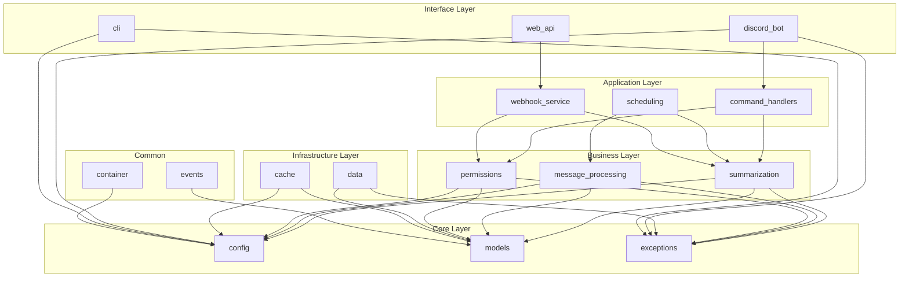

# Summary Bot NG - Implementation Architecture Design

## 1. Implementation Overview

### 1.1 Current State Analysis
- **Documentation Status**: Complete with comprehensive specifications
- **Implementation Status**: Empty src/ directory - requires full implementation
- **Architecture Basis**: Phase 3 modular architecture with layered design
- **Target System**: Discord bot with Claude API integration and webhook support

### 1.2 Implementation Strategy
- **Development Approach**: Test-Driven Development (TDD) with SPARC methodology  
- **Architecture Pattern**: Layered architecture with dependency injection
- **Module Structure**: 12 core modules + 6 infrastructure modules
- **Technology Stack**: Python 3.8+, Discord.py, FastAPI, PostgreSQL, Redis

## 2. Implementation Architecture

### 2.1 Directory Structure Design

```
src/
├── core/                           # Core modules (no dependencies)
│   ├── config/                     # Configuration management
│   │   ├── __init__.py
│   │   ├── settings.py             # Main configuration class
│   │   ├── environment.py          # Environment variable handling
│   │   ├── validation.py           # Configuration validation
│   │   └── defaults.py             # Default values
│   ├── models/                     # Data models and DTOs
│   │   ├── __init__.py
│   │   ├── summary.py              # Summary-related models
│   │   ├── message.py              # Message processing models
│   │   ├── user.py                 # User and permission models
│   │   ├── task.py                 # Scheduled task models
│   │   ├── webhook.py              # Webhook-related models
│   │   └── base.py                 # Base model classes
│   └── exceptions/                 # Custom exception hierarchy
│       ├── __init__.py
│       ├── base.py                 # Base exception classes
│       ├── summarization.py        # Summarization-specific errors
│       ├── discord_errors.py       # Discord API-related errors
│       ├── api_errors.py           # External API errors
│       └── validation.py           # Validation errors
│
├── business/                       # Business logic modules
│   ├── summarization/              # AI-powered summarization engine
│   │   ├── __init__.py
│   │   ├── engine.py               # Main summarization engine
│   │   ├── claude_client.py        # Claude API client
│   │   ├── prompt_builder.py       # Dynamic prompt generation
│   │   ├── response_parser.py      # Claude response processing
│   │   ├── cache.py                # Summary caching logic
│   │   └── optimization.py         # Performance optimizations
│   ├── message_processing/         # Discord message handling
│   │   ├── __init__.py
│   │   ├── fetcher.py              # Discord message fetching
│   │   ├── filter.py               # Message filtering logic
│   │   ├── cleaner.py              # Content cleaning/normalization
│   │   ├── extractor.py            # Information extraction
│   │   └── validator.py            # Message validation
│   └── permissions/                # Permission management
│       ├── __init__.py
│       ├── manager.py              # Main permission manager
│       ├── validators.py           # Permission validation logic
│       ├── roles.py                # Role-based access control
│       └── cache.py                # Permission caching
│
├── application/                    # Application service layer
│   ├── command_handlers/           # Discord command handlers
│   │   ├── __init__.py
│   │   ├── base.py                 # Base command handler
│   │   ├── summarize.py            # Summarize command handler
│   │   ├── config.py               # Configuration commands
│   │   ├── schedule.py             # Scheduling commands
│   │   └── utils.py                # Command utilities
│   ├── scheduling/                 # Task scheduling service
│   │   ├── __init__.py
│   │   ├── scheduler.py            # Main task scheduler
│   │   ├── tasks.py                # Task definitions
│   │   ├── executor.py             # Task execution logic
│   │   └── persistence.py          # Task state persistence
│   └── webhook_service/            # HTTP API endpoints
│       ├── __init__.py
│       ├── server.py               # FastAPI server setup
│       ├── endpoints.py            # API endpoint definitions
│       ├── auth.py                 # Authentication middleware
│       ├── validators.py           # Request validation
│       └── formatters.py           # Response formatting
│
├── infrastructure/                 # Infrastructure layer
│   ├── data/                       # Data access layer
│   │   ├── __init__.py
│   │   ├── base.py                 # Abstract interfaces
│   │   ├── sqlite.py               # SQLite implementation
│   │   ├── postgresql.py           # PostgreSQL implementation
│   │   ├── migrations/             # Database migrations
│   │   │   ├── __init__.py
│   │   │   ├── 001_initial.py      # Initial schema
│   │   │   └── migration_runner.py # Migration management
│   │   └── repositories/           # Repository implementations
│   │       ├── __init__.py
│   │       ├── summary_repo.py     # Summary repository
│   │       ├── config_repo.py      # Configuration repository
│   │       └── task_repo.py        # Task repository
│   └── cache/                      # Caching layer
│       ├── __init__.py
│       ├── base.py                 # Abstract cache interfaces
│       ├── memory.py               # In-memory cache
│       ├── redis.py                # Redis cache implementation
│       └── utils.py                # Cache utilities
│
├── interfaces/                     # Interface modules
│   ├── discord_bot/                # Discord bot interface
│   │   ├── __init__.py
│   │   ├── bot.py                  # Main bot client
│   │   ├── events.py               # Discord event handlers
│   │   ├── commands.py             # Command registration
│   │   └── utils.py                # Bot utilities
│   ├── web_api/                    # REST API interface
│   │   ├── __init__.py
│   │   ├── app.py                  # FastAPI application
│   │   ├── routes/                 # API routes
│   │   │   ├── __init__.py
│   │   │   ├── summary.py          # Summary endpoints
│   │   │   ├── webhooks.py         # Webhook endpoints
│   │   │   └── health.py           # Health check endpoints
│   │   └── middleware.py           # API middleware
│   └── cli/                        # Command-line interface
│       ├── __init__.py
│       ├── main.py                 # CLI entry point
│       ├── commands.py             # CLI commands
│       └── utils.py                # CLI utilities
│
├── common/                         # Shared utilities
│   ├── __init__.py
│   ├── container.py                # Dependency injection container
│   ├── events.py                   # Event bus system
│   ├── logging.py                  # Logging configuration
│   ├── metrics.py                  # Metrics collection
│   └── utils.py                    # General utilities
│
└── main.py                         # Application entry point
```

### 2.2 Implementation Dependencies Graph



## 3. Implementation Phases

### 3.1 Phase 1: Core Infrastructure (Priority 1)
**Duration**: 2-3 days  
**Dependencies**: None

#### Tasks:
1. **Core Module Implementation**
   - Implement configuration system with environment loading
   - Create comprehensive data models with validation
   - Build exception hierarchy with error codes
   - Set up logging and metrics collection

2. **Infrastructure Services**
   - Database layer with PostgreSQL and SQLite support
   - Redis caching implementation
   - Migration system setup
   - Repository pattern implementation

3. **Testing Foundation**
   - Unit test framework setup (pytest)
   - Mock factories for testing
   - Test database configuration
   - CI/CD pipeline setup

**Deliverables**:
- Functional configuration system
- Complete data models
- Database layer with migrations
- Cache implementation
- Test framework

### 3.2 Phase 2: Business Logic (Priority 1)
**Duration**: 3-4 days  
**Dependencies**: Phase 1 complete

#### Tasks:
1. **Claude API Integration**
   - Claude client implementation with rate limiting
   - Prompt builder with dynamic templates  
   - Response parser with error handling
   - Cost estimation and usage tracking

2. **Message Processing**
   - Discord message fetcher with pagination
   - Content filtering and cleaning
   - Information extraction (mentions, code blocks)
   - Message validation and preprocessing

3. **Permission System**
   - Role-based access control
   - Permission validation logic
   - Cache integration for performance
   - Guild-specific permission settings

**Deliverables**:
- Claude API integration
- Message processing pipeline
- Permission management system
- Business logic tests

### 3.3 Phase 3: Application Services (Priority 2)
**Duration**: 2-3 days  
**Dependencies**: Phase 2 complete

#### Tasks:
1. **Command Handlers**
   - Discord slash command implementation
   - Command validation and error handling
   - Response formatting for Discord
   - Permission integration

2. **Scheduling Service**
   - Task scheduler with APScheduler
   - Task persistence and recovery
   - Automated summary generation
   - Failure handling and retries

3. **Webhook Service**
   - FastAPI application setup
   - REST endpoint implementation
   - Authentication middleware
   - Request/response validation

**Deliverables**:
- Discord command handlers
- Task scheduling system
- REST API service
- Integration tests

### 3.4 Phase 4: Interface Layer (Priority 2)
**Duration**: 2-3 days  
**Dependencies**: Phase 3 complete

#### Tasks:
1. **Discord Bot**
   - Bot client setup and configuration
   - Event handling implementation
   - Command registration system
   - Error handling and logging

2. **Web API**
   - API route implementation
   - OpenAPI documentation
   - Rate limiting and security
   - Health check endpoints

3. **CLI Interface**
   - Command-line interface setup
   - Configuration management commands
   - Administrative tools
   - Help system

**Deliverables**:
- Functional Discord bot
- Complete REST API
- CLI administration tools
- End-to-end tests

### 3.5 Phase 5: Integration & Deployment (Priority 3)
**Duration**: 1-2 days  
**Dependencies**: Phase 4 complete

#### Tasks:
1. **System Integration**
   - Service container configuration
   - Event bus implementation
   - Cross-module communication
   - Performance optimization

2. **Deployment Setup**
   - Docker containerization
   - Environment configuration
   - Health monitoring setup
   - Log aggregation

3. **Quality Assurance**
   - Load testing implementation
   - Security validation
   - Performance benchmarking
   - Documentation updates

**Deliverables**:
- Integrated system
- Deployment configuration
- Performance tests
- Production-ready build

## 4. Technical Implementation Specifications

### 4.1 Development Standards

#### Code Quality
- **Type Hints**: All functions must have complete type annotations
- **Docstrings**: Google-style docstrings for all public methods
- **Error Handling**: Comprehensive exception handling with specific error types
- **Logging**: Structured logging with correlation IDs
- **Testing**: Minimum 90% test coverage per module

#### Performance Requirements
- **API Response Time**: < 200ms for cached responses, < 30s for Claude API calls
- **Memory Usage**: < 512MB baseline, < 2GB peak during processing
- **Concurrency**: Support for 10+ concurrent summarization requests
- **Database**: Query performance < 100ms for most operations

### 4.2 Key Architectural Decisions

#### ADR-001: Dependency Injection Container
**Decision**: Use a custom dependency injection container
**Rationale**: Enables loose coupling, easy testing, and service lifecycle management
**Alternatives**: Direct instantiation, factory pattern
**Trade-offs**: Additional complexity for improved testability and maintainability

#### ADR-002: Event-Driven Architecture
**Decision**: Implement event bus for cross-module communication
**Rationale**: Decouples modules, enables extensibility, improves testability
**Alternatives**: Direct method calls, observer pattern
**Trade-offs**: Slight performance overhead for improved modularity

#### ADR-003: Repository Pattern
**Decision**: Use repository pattern for data access
**Rationale**: Abstracts database implementation, enables testing, supports multiple backends
**Alternatives**: Direct ORM usage, active record pattern
**Trade-offs**: Additional abstraction layer for improved testability

### 4.3 Integration Points

#### Claude API Integration
```python
# Rate limiting and error handling strategy
class ClaudeClientConfig:
    api_key: str
    base_url: str = "https://api.anthropic.com"
    rate_limit: int = 10  # requests per minute
    timeout: int = 30  # seconds
    max_retries: int = 3
    retry_backoff: float = 2.0  # exponential backoff multiplier
```

#### Discord API Integration
```python
# Discord client configuration
class DiscordConfig:
    token: str
    intents: discord.Intents = discord.Intents.default()
    command_prefix: str = "!"
    max_message_fetch: int = 10000
    rate_limit_strategy: str = "adaptive"
```

#### Database Schema Design
```sql
-- Core tables for summarization system
CREATE TABLE summaries (
    id UUID PRIMARY KEY DEFAULT gen_random_uuid(),
    guild_id VARCHAR(20) NOT NULL,
    channel_id VARCHAR(20) NOT NULL,
    user_id VARCHAR(20) NOT NULL,
    content TEXT NOT NULL,
    message_count INTEGER NOT NULL,
    start_time TIMESTAMP WITH TIME ZONE NOT NULL,
    end_time TIMESTAMP WITH TIME ZONE NOT NULL,
    created_at TIMESTAMP WITH TIME ZONE DEFAULT NOW(),
    updated_at TIMESTAMP WITH TIME ZONE DEFAULT NOW()
);

CREATE TABLE scheduled_tasks (
    id UUID PRIMARY KEY DEFAULT gen_random_uuid(),
    guild_id VARCHAR(20) NOT NULL,
    task_type VARCHAR(50) NOT NULL,
    schedule_expression VARCHAR(100) NOT NULL,
    configuration JSONB NOT NULL,
    is_active BOOLEAN DEFAULT true,
    created_at TIMESTAMP WITH TIME ZONE DEFAULT NOW()
);

CREATE TABLE guild_configurations (
    guild_id VARCHAR(20) PRIMARY KEY,
    settings JSONB NOT NULL,
    created_at TIMESTAMP WITH TIME ZONE DEFAULT NOW(),
    updated_at TIMESTAMP WITH TIME ZONE DEFAULT NOW()
);
```

## 5. Testing Strategy

### 5.1 Test Architecture
```
tests/
├── unit/                   # Unit tests (90% coverage target)
│   ├── core/              # Core module tests
│   ├── business/          # Business logic tests  
│   ├── application/       # Application service tests
│   └── infrastructure/    # Infrastructure tests
├── integration/           # Integration tests
│   ├── api/              # API integration tests
│   ├── database/         # Database integration tests
│   └── external/         # External service tests
├── e2e/                  # End-to-end tests
│   ├── discord/          # Discord workflow tests
│   ├── webhook/          # Webhook workflow tests
│   └── cli/              # CLI workflow tests
├── performance/          # Performance and load tests
├── fixtures/             # Test data and fixtures
└── utils/               # Test utilities and helpers
```

### 5.2 Test Implementation Strategy

#### Unit Testing
- **Framework**: pytest with asyncio support
- **Mocking**: unittest.mock for external dependencies  
- **Coverage**: pytest-cov with 90% minimum threshold
- **Fixtures**: Reusable test data factories

#### Integration Testing
- **Database**: Test database with transaction rollback
- **External APIs**: Mocked responses with realistic data
- **Services**: Real service integration with test configurations

#### End-to-End Testing
- **Discord**: Bot interactions with test guild
- **API**: Full request/response lifecycle
- **Performance**: Load testing with realistic scenarios

## 6. Security Implementation

### 6.1 Security Controls
- **Input Validation**: Comprehensive request validation with Pydantic
- **Authentication**: JWT tokens with rotation
- **Authorization**: Role-based access control (RBAC)
- **Rate Limiting**: Per-user and per-endpoint rate limiting
- **Data Protection**: Encryption at rest and in transit

### 6.2 Security Testing
- **Vulnerability Scanning**: Automated security scans in CI/CD
- **Penetration Testing**: Manual security validation
- **Audit Logging**: Comprehensive security event logging
- **Compliance**: GDPR compliance validation

## 7. Deployment Architecture

### 7.1 Container Strategy
```dockerfile
# Multi-stage build for production optimization
FROM python:3.11-slim as builder
WORKDIR /app
COPY requirements.txt .
RUN pip install --user -r requirements.txt

FROM python:3.11-slim as production  
WORKDIR /app
COPY --from=builder /root/.local /root/.local
COPY src/ ./src/
ENV PATH=/root/.local/bin:$PATH
CMD ["python", "src/main.py"]
```

### 7.2 Kubernetes Configuration
```yaml
# Production deployment configuration
apiVersion: apps/v1
kind: Deployment
metadata:
  name: summarybot-ng
spec:
  replicas: 3
  selector:
    matchLabels:
      app: summarybot-ng
  template:
    metadata:
      labels:
        app: summarybot-ng
    spec:
      containers:
      - name: summarybot-ng
        image: summarybot-ng:latest
        ports:
        - containerPort: 8000
        env:
        - name: DATABASE_URL
          valueFrom:
            secretKeyRef:
              name: db-secret
              key: url
```

## 8. Monitoring and Observability

### 8.1 Metrics Collection
- **Application Metrics**: Response times, error rates, throughput
- **Business Metrics**: Summaries generated, API usage, user activity
- **Infrastructure Metrics**: CPU, memory, database performance
- **External API Metrics**: Claude API usage, Discord API rate limits

### 8.2 Logging Strategy
- **Structured Logging**: JSON format with correlation IDs
- **Log Levels**: DEBUG, INFO, WARNING, ERROR with appropriate usage
- **Log Aggregation**: Centralized logging with search capabilities
- **Security Logs**: Authentication events, permission checks, errors

## 9. Next Steps - Implementation Execution

### 9.1 Immediate Actions
1. **Environment Setup**: Development environment with Python 3.11+, PostgreSQL, Redis
2. **Repository Setup**: Git repository with CI/CD pipeline configuration
3. **Core Implementation**: Start with Phase 1 - Core Infrastructure
4. **Testing Setup**: Implement testing framework and initial test cases

### 9.2 Development Team Coordination
- **Task Assignment**: Assign developers to specific phases/modules
- **Code Review Process**: Implement mandatory code reviews
- **Integration Cadence**: Daily integration of completed modules
- **Quality Gates**: Automated quality checks at each phase

### 9.3 Risk Mitigation
- **External API Dependency**: Implement circuit breakers and fallback mechanisms
- **Performance Risk**: Early performance testing and optimization
- **Security Risk**: Security review at each phase completion
- **Integration Risk**: Continuous integration testing

---

**Document Status**: Ready for Implementation  
**Architecture Confidence**: High (based on comprehensive specifications)  
**Implementation Complexity**: Medium-High (12+ modules, external integrations)  
**Estimated Timeline**: 10-15 development days with 2-3 developers  
**Risk Level**: Low (well-documented requirements, proven technology stack)