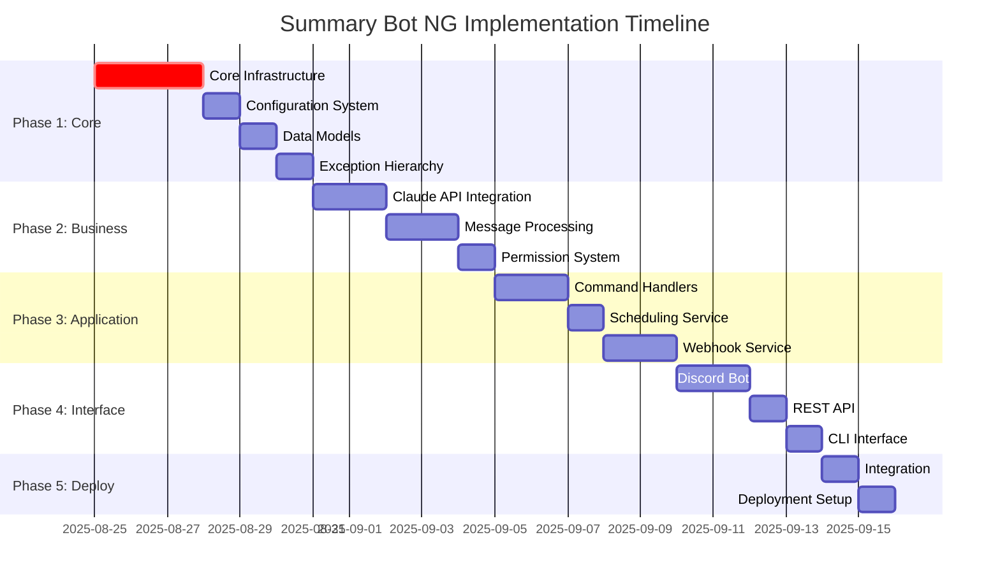

# Summary Bot NG - Implementation Plan

## 1. Implementation Roadmap

### 1.1 Project Execution Strategy
- **Methodology**: SPARC with Test-Driven Development (TDD)
- **Architecture Pattern**: Layered architecture with dependency injection
- **Development Approach**: Incremental implementation with continuous integration
- **Quality Assurance**: 90%+ test coverage with comprehensive integration testing

### 1.2 Development Timeline
**Total Estimated Duration**: 10-15 development days (2-3 developers)



## 2. Phase-by-Phase Implementation Details

### 2.1 Phase 1: Core Infrastructure (Days 1-3)

#### Core Configuration System
```python
# Priority: Critical
# Files: src/core/config/
# Dependencies: None

Implementation Tasks:
1. Environment variable loading with .env support
2. Configuration validation with Pydantic
3. Guild-specific configuration management  
4. Hot-reload capability for development
5. Configuration schema documentation

Key Components:
- settings.py: Main BotConfig class with validation
- environment.py: Environment variable processing
- validation.py: Configuration validation rules
- defaults.py: Default configuration values

Testing Requirements:
- Configuration loading tests
- Validation error handling tests  
- Environment variable override tests
- Guild configuration management tests
```

#### Data Models Implementation  
```python
# Priority: Critical
# Files: src/core/models/
# Dependencies: Configuration

Implementation Tasks:
1. Base model classes with serialization
2. Summary-related models (SummaryResult, SummaryOptions)
3. Message processing models (ProcessedMessage, MessageBatch)
4. User/permission models (UserPermissions, GuildConfig)
5. Task/webhook models (ScheduledTask, WebhookRequest)

Key Components:
- base.py: Base model with common functionality
- summary.py: Summary domain models
- message.py: Message processing models
- user.py: User and permission models
- task.py: Scheduling and task models

Testing Requirements:
- Model validation tests
- Serialization/deserialization tests
- Type conversion tests
- Edge case handling tests
```

#### Exception Hierarchy
```python
# Priority: Critical  
# Files: src/core/exceptions/
# Dependencies: None

Implementation Tasks:
1. Base exception with error codes
2. Domain-specific exceptions (summarization, Discord, API)
3. Error context preservation
4. Logging integration
5. User-friendly error messages

Key Components:
- base.py: SummaryBotException base class
- summarization.py: AI/Claude related errors
- discord_errors.py: Discord API errors
- api_errors.py: External API errors
- validation.py: Input validation errors

Testing Requirements:
- Exception hierarchy tests
- Error code validation
- Context preservation tests
- Error message formatting tests
```

#### Infrastructure Services
```python
# Priority: Critical
# Files: src/infrastructure/
# Dependencies: Core models

Implementation Tasks:
1. Database layer with PostgreSQL/SQLite support
2. Repository pattern implementation
3. Redis cache implementation  
4. Migration system setup
5. Connection pooling and health checks

Key Components:
- data/base.py: Repository interfaces
- data/postgresql.py: PostgreSQL implementation  
- data/sqlite.py: SQLite implementation
- cache/redis.py: Redis cache backend
- data/migrations/: Database migration system

Testing Requirements:
- Repository pattern tests
- Database connection tests
- Migration system tests
- Cache functionality tests
```

### 2.2 Phase 2: Business Logic (Days 4-7)

#### Claude API Integration
```python
# Priority: Critical
# Files: src/business/summarization/
# Dependencies: Core infrastructure

Implementation Tasks:
1. Claude client with rate limiting
2. Prompt template system
3. Response parsing and validation
4. Cost estimation and usage tracking
5. Error handling and retries

Key Components:
- claude_client.py: Anthropic API client
- prompt_builder.py: Dynamic prompt generation
- response_parser.py: Response processing
- engine.py: Main summarization engine
- optimization.py: Performance optimizations

Testing Requirements:
- Claude API integration tests (mocked)
- Prompt generation tests
- Response parsing tests
- Rate limiting tests
- Error handling tests
```

#### Message Processing Pipeline
```python
# Priority: Critical
# Files: src/business/message_processing/
# Dependencies: Core models, Configuration

Implementation Tasks:
1. Discord message fetching with pagination
2. Content filtering and cleaning
3. Information extraction (mentions, code blocks, etc.)
4. Message validation and preprocessing
5. Batch processing optimization

Key Components:
- fetcher.py: Discord message retrieval
- filter.py: Message filtering logic
- cleaner.py: Content cleaning and normalization
- extractor.py: Information extraction
- validator.py: Message validation

Testing Requirements:
- Message fetching tests (mocked Discord API)
- Content filtering tests
- Information extraction tests
- Validation logic tests
- Performance tests for large message batches
```

#### Permission Management System
```python
# Priority: High
# Files: src/business/permissions/
# Dependencies: Core models, Configuration

Implementation Tasks:
1. Role-based access control (RBAC)
2. Permission validation logic
3. Guild-specific permission settings
4. Permission caching for performance
5. Administrative override functionality

Key Components:
- manager.py: Main permission manager
- validators.py: Permission validation
- roles.py: Role-based access control
- cache.py: Permission result caching

Testing Requirements:
- Permission validation tests
- Role hierarchy tests
- Cache performance tests
- Guild-specific permission tests
```

### 2.3 Phase 3: Application Services (Days 8-10)

#### Discord Command Handlers
```python
# Priority: High
# Files: src/application/command_handlers/
# Dependencies: Business logic layer

Implementation Tasks:
1. Slash command implementation
2. Command parameter validation
3. Response formatting for Discord
4. Error handling and user feedback
5. Permission integration

Key Components:
- base.py: Base command handler
- summarize.py: Main summarization commands
- config.py: Configuration management commands
- schedule.py: Task scheduling commands
- utils.py: Command utilities

Testing Requirements:
- Command interaction tests (mocked Discord interactions)
- Parameter validation tests
- Error handling tests
- Permission integration tests
```

#### Task Scheduling Service
```python
# Priority: Medium
# Files: src/application/scheduling/
# Dependencies: Business logic layer

Implementation Tasks:
1. APScheduler integration
2. Task persistence and recovery
3. Automated summary generation
4. Failure handling and retries
5. Task monitoring and metrics

Key Components:
- scheduler.py: Main task scheduler
- tasks.py: Task definitions and logic
- executor.py: Task execution engine
- persistence.py: Task state management

Testing Requirements:
- Task scheduling tests
- Task execution tests
- Failure recovery tests
- Persistence layer tests
```

#### Webhook Service
```python
# Priority: Medium
# Files: src/application/webhook_service/
# Dependencies: Business logic layer

Implementation Tasks:
1. FastAPI application setup
2. REST endpoint implementation
3. Authentication middleware (JWT/API Key)
4. Request/response validation
5. Async processing support

Key Components:
- server.py: FastAPI application
- endpoints.py: REST endpoint definitions
- auth.py: Authentication middleware
- validators.py: Request validation
- formatters.py: Response formatting

Testing Requirements:
- API endpoint tests
- Authentication tests
- Request validation tests
- Response formatting tests
```

### 2.4 Phase 4: Interface Layer (Days 11-13)

#### Discord Bot Implementation
```python
# Priority: Critical
# Files: src/interfaces/discord_bot/
# Dependencies: Application services

Implementation Tasks:
1. Discord.py bot client setup
2. Event handling implementation
3. Command registration system
4. Error handling and logging
5. Bot lifecycle management

Key Components:
- bot.py: Main Discord bot client
- events.py: Discord event handlers
- commands.py: Command registration
- utils.py: Bot utilities

Testing Requirements:
- Bot lifecycle tests
- Event handling tests
- Command registration tests
- Integration tests with command handlers
```

#### REST API Interface
```python
# Priority: Medium
# Files: src/interfaces/web_api/
# Dependencies: Webhook service

Implementation Tasks:
1. FastAPI route organization
2. OpenAPI documentation generation
3. Rate limiting implementation
4. Health check endpoints
5. CORS configuration

Key Components:
- app.py: FastAPI application setup
- routes/summary.py: Summary endpoints
- routes/webhooks.py: Webhook endpoints
- routes/health.py: Health check endpoints
- middleware.py: API middleware

Testing Requirements:
- API route tests
- Rate limiting tests
- Health check tests
- OpenAPI documentation validation
```

#### CLI Interface
```python
# Priority: Low
# Files: src/interfaces/cli/
# Dependencies: Core services

Implementation Tasks:
1. Click-based CLI framework
2. Configuration management commands
3. Administrative utilities
4. Help system and documentation
5. Error handling and user feedback

Key Components:
- main.py: CLI entry point
- commands.py: CLI command definitions
- utils.py: CLI utilities

Testing Requirements:
- CLI command tests
- Help system tests
- Error handling tests
- Integration tests
```

### 2.5 Phase 5: Integration & Deployment (Days 14-15)

#### System Integration
```python
# Priority: Critical
# Files: src/common/
# Dependencies: All layers

Implementation Tasks:
1. Dependency injection container
2. Event bus implementation
3. Service lifecycle management
4. Cross-module communication
5. Performance optimization

Key Components:
- container.py: Service container
- events.py: Event bus system
- logging.py: Logging configuration
- metrics.py: Metrics collection

Testing Requirements:
- Service container tests
- Event bus tests
- Integration tests across all modules
- Performance benchmarks
```

#### Deployment Configuration
```python
# Priority: High  
# Files: deployment/
# Dependencies: Complete system

Implementation Tasks:
1. Docker containerization
2. Environment configuration templates
3. Kubernetes deployment manifests
4. Health monitoring setup
5. Log aggregation configuration

Key Components:
- Dockerfile: Multi-stage container build
- docker-compose.yml: Development environment
- k8s/: Kubernetes manifests
- monitoring/: Health check configuration

Testing Requirements:
- Container build tests
- Deployment validation tests
- Health monitoring tests
- Load testing
```

## 3. File Structure Implementation Order

### 3.1 Core Layer (Phase 1)
```bash
# Day 1: Configuration and Models
src/core/config/
├── __init__.py          ✓ 
├── settings.py          ✓ Main configuration classes
├── environment.py       ✓ Environment loading
├── validation.py        ✓ Config validation  
└── defaults.py          ✓ Default values

src/core/models/
├── __init__.py          ✓
├── base.py             ✓ Base model functionality
├── summary.py          ✓ Summary domain models
├── message.py          ✓ Message models
├── user.py             ✓ User/permission models
├── task.py             ✓ Task models
└── webhook.py          ✓ Webhook models

# Day 2: Exceptions and Infrastructure Base
src/core/exceptions/
├── __init__.py          ✓
├── base.py             ✓ Base exception classes
├── summarization.py    ✓ AI/Claude errors
├── discord_errors.py   ✓ Discord API errors
├── api_errors.py       ✓ External API errors
└── validation.py       ✓ Validation errors

# Day 3: Infrastructure Implementation  
src/infrastructure/data/
├── __init__.py          ✓
├── base.py             ✓ Repository interfaces
├── sqlite.py           ✓ SQLite implementation
├── postgresql.py       ✓ PostgreSQL implementation
└── migrations/         ✓ Migration system

src/infrastructure/cache/
├── __init__.py          ✓
├── base.py             ✓ Cache interfaces
├── memory.py           ✓ In-memory cache
├── redis.py            ✓ Redis implementation
└── utils.py            ✓ Cache utilities
```

### 3.2 Business Layer (Phase 2)
```bash
# Day 4-5: Claude API and Summarization
src/business/summarization/
├── __init__.py          ✓
├── claude_client.py     ✓ Claude API client
├── prompt_builder.py    ✓ Prompt generation
├── response_parser.py   ✓ Response processing
├── engine.py           ✓ Main engine
├── cache.py            ✓ Summary caching
└── optimization.py     ✓ Performance opts

# Day 6: Message Processing
src/business/message_processing/
├── __init__.py          ✓
├── fetcher.py          ✓ Discord message fetching
├── filter.py           ✓ Message filtering
├── cleaner.py          ✓ Content cleaning
├── extractor.py        ✓ Information extraction
└── validator.py        ✓ Message validation

# Day 7: Permission System
src/business/permissions/
├── __init__.py          ✓
├── manager.py          ✓ Permission manager
├── validators.py       ✓ Permission validation
├── roles.py            ✓ RBAC implementation
└── cache.py            ✓ Permission caching
```

### 3.3 Application Layer (Phase 3)
```bash
# Day 8-9: Command Handlers
src/application/command_handlers/
├── __init__.py          ✓
├── base.py             ✓ Base command handler
├── summarize.py        ✓ Summarization commands
├── config.py           ✓ Config commands
├── schedule.py         ✓ Scheduling commands
└── utils.py            ✓ Command utilities

# Day 9: Scheduling Service
src/application/scheduling/
├── __init__.py          ✓
├── scheduler.py        ✓ Task scheduler
├── tasks.py            ✓ Task definitions
├── executor.py         ✓ Task execution
└── persistence.py      ✓ Task persistence

# Day 10: Webhook Service  
src/application/webhook_service/
├── __init__.py          ✓
├── server.py           ✓ FastAPI server
├── endpoints.py        ✓ API endpoints
├── auth.py             ✓ Authentication
├── validators.py       ✓ Request validation
└── formatters.py       ✓ Response formatting
```

### 3.4 Interface Layer (Phase 4)
```bash
# Day 11-12: Discord Bot
src/interfaces/discord_bot/
├── __init__.py          ✓
├── bot.py              ✓ Main bot client
├── events.py           ✓ Event handlers
├── commands.py         ✓ Command registration
└── utils.py            ✓ Bot utilities

# Day 12: Web API
src/interfaces/web_api/
├── __init__.py          ✓
├── app.py              ✓ FastAPI app
├── routes/             ✓ API routes
└── middleware.py       ✓ API middleware

# Day 13: CLI Interface
src/interfaces/cli/
├── __init__.py          ✓
├── main.py             ✓ CLI entry point
├── commands.py         ✓ CLI commands
└── utils.py            ✓ CLI utilities
```

### 3.5 Common & Integration (Phase 5)
```bash
# Day 14: Common Services
src/common/
├── __init__.py          ✓
├── container.py        ✓ DI container
├── events.py           ✓ Event bus
├── logging.py          ✓ Logging config
├── metrics.py          ✓ Metrics collection
└── utils.py            ✓ General utilities

# Day 14-15: Main Application
src/main.py             ✓ Application entry point

# Day 15: Deployment
deployment/
├── Dockerfile          ✓ Container definition
├── docker-compose.yml  ✓ Dev environment  
├── k8s/               ✓ Kubernetes manifests
└── monitoring/        ✓ Health monitoring
```

## 4. Testing Implementation Strategy

### 4.1 Test Structure
```bash
tests/
├── unit/               # Unit tests (parallel with development)
│   ├── core/          # Core module tests
│   ├── business/      # Business logic tests
│   ├── application/   # Application service tests
│   └── infrastructure/ # Infrastructure tests
├── integration/        # Integration tests (Phase 4-5)
│   ├── api/           # API integration tests
│   ├── database/      # Database integration
│   └── external/      # External service tests  
├── e2e/               # End-to-end tests (Phase 5)
│   ├── discord/       # Discord workflow tests
│   ├── webhook/       # Webhook workflow tests
│   └── cli/           # CLI workflow tests
├── fixtures/          # Test data and factories
└── utils/            # Test utilities
```

### 4.2 Testing Schedule
- **Unit Tests**: Developed alongside each module (90% coverage minimum)
- **Integration Tests**: Implemented during Phases 4-5
- **E2E Tests**: Implemented during Phase 5
- **Performance Tests**: Implemented during Phase 5

## 5. Quality Gates & Milestones

### 5.1 Phase Completion Criteria

#### Phase 1 Completion (Day 3)
- ✅ All core modules implemented with tests
- ✅ Configuration system functional
- ✅ Database layer working with migrations
- ✅ Cache implementation functional
- ✅ Unit test coverage > 90%

#### Phase 2 Completion (Day 7)  
- ✅ Claude API integration working
- ✅ Message processing pipeline functional
- ✅ Permission system implemented
- ✅ Business logic tests passing
- ✅ Integration with core infrastructure

#### Phase 3 Completion (Day 10)
- ✅ Command handlers implemented  
- ✅ Scheduling service functional
- ✅ Webhook service working
- ✅ Application layer tests passing
- ✅ Integration with business logic

#### Phase 4 Completion (Day 13)
- ✅ Discord bot functional
- ✅ REST API working
- ✅ CLI interface implemented
- ✅ Interface layer tests passing
- ✅ End-to-end workflow validation

#### Phase 5 Completion (Day 15)
- ✅ System integration complete
- ✅ Deployment configuration ready
- ✅ Performance benchmarks met
- ✅ Security validation complete
- ✅ Production-ready system

### 5.2 Continuous Quality Checks
- **Code Review**: All code must be reviewed before merge
- **Automated Testing**: CI/CD pipeline runs all tests on every commit
- **Security Scanning**: Automated security scans on dependencies and code
- **Performance Monitoring**: Performance regression detection
- **Documentation**: API documentation auto-generated and validated

## 6. Risk Management

### 6.1 Technical Risks

#### High Risk: External API Dependencies
- **Risk**: Claude API rate limits or service unavailability
- **Mitigation**: Circuit breaker pattern, fallback responses, comprehensive retry logic
- **Monitoring**: API health checks, usage metrics, error rate tracking

#### Medium Risk: Discord API Integration Complexity
- **Risk**: Discord API changes or bot permission issues
- **Mitigation**: Comprehensive error handling, permission validation, API versioning
- **Monitoring**: Discord API health checks, bot status monitoring

#### Low Risk: Database Performance  
- **Risk**: Database performance issues with large message batches
- **Mitigation**: Query optimization, connection pooling, caching layer
- **Monitoring**: Database performance metrics, query analysis

### 6.2 Project Risks

#### Schedule Risk: Complex Integration Points
- **Risk**: Integration between layers takes longer than estimated
- **Mitigation**: Early integration testing, incremental integration approach
- **Contingency**: Parallel development of integration tests

#### Quality Risk: Test Coverage Gaps
- **Risk**: Insufficient test coverage leading to production issues  
- **Mitigation**: Automated coverage reporting, mandatory coverage gates
- **Contingency**: Extended testing phase if coverage targets not met

## 7. Next Steps - Development Kickoff

### 7.1 Pre-Development Setup (Day 0)
1. **Development Environment**:
   - Python 3.11+ installation
   - PostgreSQL and Redis setup
   - Git repository initialization
   - IDE/editor configuration

2. **Project Structure Creation**:
   - Create directory structure as defined
   - Initialize Python package structure
   - Setup requirements.txt and pyproject.toml
   - Configure pre-commit hooks

3. **CI/CD Pipeline Setup**:
   - GitHub Actions or equivalent setup
   - Automated testing pipeline
   - Code quality checks (Black, flake8, mypy)
   - Security scanning integration

### 7.2 Development Team Coordination
1. **Role Assignment**:
   - Lead Developer: Overall architecture and integration
   - Backend Developer: Core and business logic implementation
   - Integration Developer: Application services and interfaces
   - DevOps Engineer: Infrastructure and deployment

2. **Communication Channels**:
   - Daily standups for progress tracking
   - Code review process establishment
   - Issue tracking and project management
   - Documentation updates coordination

### 7.3 Success Metrics
- **Development Velocity**: Target completion within 15 days
- **Code Quality**: 90%+ test coverage, zero critical security issues
- **Performance**: API response times < 30 seconds, 99%+ uptime
- **Functionality**: All specified features working as documented

---

**Implementation Plan Status**: Ready for Execution  
**Confidence Level**: High (comprehensive specifications and clear architecture)  
**Team Requirements**: 2-3 developers with Python/Discord.py/FastAPI experience  
**Success Probability**: High (well-defined phases with clear deliverables)  
**Next Action**: Development environment setup and Phase 1 kickoff