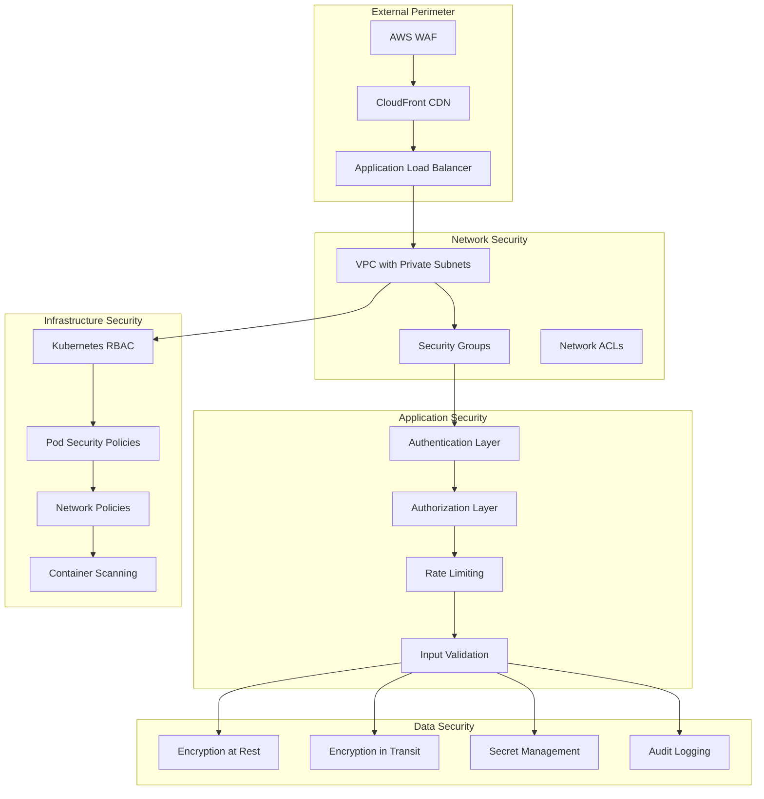

# Summary Bot NG - Security Architecture

## 7. Security Architecture

### 7.1 Security Overview



### 7.2 Authentication Architecture

```python
from abc import ABC, abstractmethod
from typing import Optional, Dict, Any
from datetime import datetime, timedelta
import jwt
from passlib.context import CryptContext
import secrets
import hashlib

class AuthenticationProvider(ABC):
    @abstractmethod
    async def authenticate(self, credentials: Dict[str, Any]) -> Optional['AuthToken']:
        pass
    
    @abstractmethod
    async def validate_token(self, token: str) -> Optional['AuthContext']:
        pass

class JWTAuthenticationProvider(AuthenticationProvider):
    def __init__(self, secret_key: str, algorithm: str = "HS256"):
        self.secret_key = secret_key
        self.algorithm = algorithm
        self.pwd_context = CryptContext(schemes=["bcrypt"], deprecated="auto")
    
    async def authenticate(self, credentials: Dict[str, Any]) -> Optional['AuthToken']:
        """Authenticate API key or Discord bot token"""
        if 'api_key' in credentials:
            return await self._authenticate_api_key(credentials['api_key'])
        elif 'discord_token' in credentials:
            return await self._authenticate_discord_token(credentials['discord_token'])
        return None
    
    async def _authenticate_api_key(self, api_key: str) -> Optional['AuthToken']:
        # Hash the API key and compare with stored hash
        api_key_hash = hashlib.sha256(api_key.encode()).hexdigest()
        
        # In production, this would query a database
        stored_api_keys = await self._get_stored_api_keys()
        
        if api_key_hash in stored_api_keys:
            user_info = stored_api_keys[api_key_hash]
            return self._generate_token(user_info)
        
        return None
    
    def _generate_token(self, user_info: Dict[str, Any]) -> 'AuthToken':
        payload = {
            'user_id': user_info['user_id'],
            'permissions': user_info['permissions'],
            'exp': datetime.utcnow() + timedelta(hours=24),
            'iat': datetime.utcnow(),
            'iss': 'summarybot-ng'
        }
        
        token = jwt.encode(payload, self.secret_key, algorithm=self.algorithm)
        return AuthToken(
            token=token,
            token_type='Bearer',
            expires_in=86400,  # 24 hours
            permissions=user_info['permissions']
        )
    
    async def validate_token(self, token: str) -> Optional['AuthContext']:
        try:
            payload = jwt.decode(
                token, 
                self.secret_key, 
                algorithms=[self.algorithm],
                options={"verify_exp": True}
            )
            
            return AuthContext(
                user_id=payload['user_id'],
                permissions=payload['permissions'],
                token_expires_at=datetime.fromtimestamp(payload['exp'])
            )
        except jwt.InvalidTokenError:
            return None

@dataclass
class AuthToken:
    token: str
    token_type: str
    expires_in: int
    permissions: List[str]

@dataclass
class AuthContext:
    user_id: str
    permissions: List[str]
    token_expires_at: datetime
    
    def has_permission(self, permission: str) -> bool:
        return permission in self.permissions or 'admin' in self.permissions
```

### 7.3 Authorization & Permission System

```python
from enum import Enum
from typing import Set
from functools import wraps

class Permission(Enum):
    # Discord permissions
    DISCORD_READ_MESSAGES = "discord:read_messages"
    DISCORD_SEND_SUMMARIES = "discord:send_summaries"
    DISCORD_MANAGE_CHANNELS = "discord:manage_channels"
    
    # Webhook permissions
    WEBHOOK_CREATE_SUMMARIES = "webhook:create_summaries"
    WEBHOOK_READ_STATUS = "webhook:read_status"
    WEBHOOK_MANAGE_ENDPOINTS = "webhook:manage_endpoints"
    
    # Admin permissions
    ADMIN_MANAGE_USERS = "admin:manage_users"
    ADMIN_VIEW_METRICS = "admin:view_metrics"
    ADMIN_MANAGE_CONFIG = "admin:manage_config"

class Role:
    def __init__(self, name: str, permissions: Set[Permission]):
        self.name = name
        self.permissions = permissions

# Predefined roles
ROLES = {
    'discord_bot': Role('discord_bot', {
        Permission.DISCORD_READ_MESSAGES,
        Permission.DISCORD_SEND_SUMMARIES,
    }),
    
    'webhook_user': Role('webhook_user', {
        Permission.WEBHOOK_CREATE_SUMMARIES,
        Permission.WEBHOOK_READ_STATUS,
    }),
    
    'admin': Role('admin', {
        Permission.DISCORD_READ_MESSAGES,
        Permission.DISCORD_SEND_SUMMARIES,
        Permission.DISCORD_MANAGE_CHANNELS,
        Permission.WEBHOOK_CREATE_SUMMARIES,
        Permission.WEBHOOK_READ_STATUS,
        Permission.WEBHOOK_MANAGE_ENDPOINTS,
        Permission.ADMIN_MANAGE_USERS,
        Permission.ADMIN_VIEW_METRICS,
        Permission.ADMIN_MANAGE_CONFIG,
    })
}

def require_permission(permission: Permission):
    """Decorator to enforce permission requirements"""
    def decorator(func):
        @wraps(func)
        async def wrapper(*args, **kwargs):
            # Extract auth context from request
            auth_context = kwargs.get('auth_context')
            if not auth_context or not auth_context.has_permission(permission.value):
                raise PermissionError(f"Required permission: {permission.value}")
            
            return await func(*args, **kwargs)
        return wrapper
    return decorator

# Usage examples
class WebhookController:
    @require_permission(Permission.WEBHOOK_CREATE_SUMMARIES)
    async def create_summary(self, request: SummaryRequest, auth_context: AuthContext):
        # Implementation
        pass
    
    @require_permission(Permission.ADMIN_VIEW_METRICS)
    async def get_metrics(self, auth_context: AuthContext):
        # Implementation
        pass
```

### 7.4 Rate Limiting & DDoS Protection

```python
import asyncio
import time
from typing import Dict, Optional
from dataclasses import dataclass
from enum import Enum

class RateLimitType(Enum):
    PER_IP = "per_ip"
    PER_USER = "per_user" 
    PER_API_KEY = "per_api_key"
    GLOBAL = "global"

@dataclass
class RateLimitConfig:
    requests: int
    window_seconds: int
    burst_allowance: int = 0

class RateLimiter:
    def __init__(self, redis_client):
        self.redis = redis_client
        self.configs = {
            # Discord API rate limits (respecting Discord's limits)
            'discord_commands': RateLimitConfig(requests=5, window_seconds=60),
            
            # Webhook API rate limits
            'webhook_requests': RateLimitConfig(requests=100, window_seconds=3600, burst_allowance=10),
            
            # OpenAI API rate limits
            'openai_requests': RateLimitConfig(requests=60, window_seconds=60),
            
            # Global protection
            'global_requests': RateLimitConfig(requests=10000, window_seconds=3600)
        }
    
    async def is_allowed(self, 
                        identifier: str, 
                        limit_type: str, 
                        rate_limit_type: RateLimitType = RateLimitType.PER_IP) -> bool:
        """Check if request is allowed under rate limits"""
        config = self.configs.get(limit_type)
        if not config:
            return True
        
        key = f"rate_limit:{rate_limit_type.value}:{limit_type}:{identifier}"
        
        # Sliding window log implementation
        now = time.time()
        window_start = now - config.window_seconds
        
        async with self.redis.pipeline() as pipe:
            # Remove old entries
            await pipe.zremrangebyscore(key, 0, window_start)
            
            # Count current requests
            current_requests = await pipe.zcard(key)
            
            if current_requests < config.requests + config.burst_allowance:
                # Add current request
                await pipe.zadd(key, {str(now): now})
                await pipe.expire(key, config.window_seconds)
                await pipe.execute()
                return True
            else:
                return False
    
    async def get_rate_limit_info(self, identifier: str, limit_type: str) -> Dict:
        """Get current rate limit status"""
        config = self.configs.get(limit_type)
        if not config:
            return {}
        
        key = f"rate_limit:per_ip:{limit_type}:{identifier}"
        now = time.time()
        window_start = now - config.window_seconds
        
        # Clean old entries and count current
        await self.redis.zremrangebyscore(key, 0, window_start)
        current_requests = await self.redis.zcard(key)
        
        return {
            'limit': config.requests,
            'remaining': max(0, config.requests - current_requests),
            'reset_time': int(now + config.window_seconds),
            'window_seconds': config.window_seconds
        }

# WAF Configuration for AWS
WAF_RULES = {
    'rate_limiting': {
        'name': 'SummaryBotRateLimit',
        'priority': 1,
        'action': 'BLOCK',
        'statement': {
            'rate_based_statement': {
                'limit': 2000,  # requests per 5-minute window
                'aggregate_key_type': 'IP'
            }
        }
    },
    
    'geo_blocking': {
        'name': 'GeoBlocking',
        'priority': 2,
        'action': 'BLOCK',
        'statement': {
            'geo_match_statement': {
                'country_codes': ['CN', 'RU', 'KP']  # Example blocked countries
            }
        }
    },
    
    'sql_injection': {
        'name': 'SQLInjectionProtection',
        'priority': 3,
        'action': 'BLOCK',
        'statement': {
            'managed_rule_group_statement': {
                'vendor_name': 'AWS',
                'name': 'AWSManagedRulesSQLiRuleSet'
            }
        }
    },
    
    'xss_protection': {
        'name': 'XSSProtection',
        'priority': 4,
        'action': 'BLOCK',
        'statement': {
            'managed_rule_group_statement': {
                'vendor_name': 'AWS',
                'name': 'AWSManagedRulesCommonRuleSet'
            }
        }
    }
}
```

### 7.5 Secrets Management

```python
import boto3
import base64
from typing import Dict, Any, Optional
from cryptography.fernet import Fernet
import os
import json

class SecretsManager:
    def __init__(self, environment: str = 'production'):
        self.environment = environment
        self.aws_secrets_client = boto3.client('secretsmanager')
        self.encryption_key = os.environ.get('ENCRYPTION_KEY', Fernet.generate_key())
        self.cipher = Fernet(self.encryption_key)
        
        # Secret name patterns
        self.secret_patterns = {
            'discord_token': f'summarybot/{environment}/discord-token',
            'openai_api_key': f'summarybot/{environment}/openai-api-key',
            'jwt_secret': f'summarybot/{environment}/jwt-secret',
            'database_password': f'summarybot/{environment}/database-password',
            'api_keys': f'summarybot/{environment}/api-keys'
        }
    
    async def get_secret(self, secret_name: str) -> Optional[str]:
        """Retrieve secret from AWS Secrets Manager"""
        try:
            secret_arn = self.secret_patterns.get(secret_name)
            if not secret_arn:
                return None
            
            response = self.aws_secrets_client.get_secret_value(SecretId=secret_arn)
            
            if 'SecretString' in response:
                secret_data = json.loads(response['SecretString'])
                return secret_data.get('value')
            else:
                return base64.b64decode(response['SecretBinary']).decode()
                
        except Exception as e:
            # Log error but don't expose secret names in logs
            print(f"Error retrieving secret: {type(e).__name__}")
            return None
    
    async def store_secret(self, secret_name: str, secret_value: str) -> bool:
        """Store secret in AWS Secrets Manager"""
        try:
            secret_arn = self.secret_patterns.get(secret_name)
            if not secret_arn:
                return False
            
            secret_data = json.dumps({'value': secret_value})
            
            self.aws_secrets_client.put_secret_value(
                SecretId=secret_arn,
                SecretString=secret_data
            )
            
            return True
        except Exception as e:
            print(f"Error storing secret: {type(e).__name__}")
            return False
    
    def encrypt_local_secret(self, data: str) -> str:
        """Encrypt data for local storage"""
        return self.cipher.encrypt(data.encode()).decode()
    
    def decrypt_local_secret(self, encrypted_data: str) -> str:
        """Decrypt locally stored data"""
        return self.cipher.decrypt(encrypted_data.encode()).decode()

# Configuration class with secret management
class SecureConfig:
    def __init__(self, secrets_manager: SecretsManager):
        self.secrets_manager = secrets_manager
        self._secrets_cache = {}
        self._cache_ttl = 3600  # 1 hour cache
        self._cache_timestamps = {}
    
    async def get_discord_token(self) -> str:
        return await self._get_cached_secret('discord_token')
    
    async def get_openai_api_key(self) -> str:
        return await self._get_cached_secret('openai_api_key')
    
    async def get_jwt_secret(self) -> str:
        return await self._get_cached_secret('jwt_secret')
    
    async def _get_cached_secret(self, secret_name: str) -> Optional[str]:
        """Get secret with caching"""
        now = time.time()
        
        # Check if cached and not expired
        if (secret_name in self._secrets_cache and 
            secret_name in self._cache_timestamps and
            now - self._cache_timestamps[secret_name] < self._cache_ttl):
            return self._secrets_cache[secret_name]
        
        # Fetch from secrets manager
        secret_value = await self.secrets_manager.get_secret(secret_name)
        
        if secret_value:
            self._secrets_cache[secret_name] = secret_value
            self._cache_timestamps[secret_name] = now
        
        return secret_value
```

### 7.6 Input Validation & Sanitization

```python
from pydantic import BaseModel, validator, Field
from typing import List, Optional
from datetime import datetime
import re
import html

class SummaryRequest(BaseModel):
    guild_id: str = Field(..., min_length=17, max_length=20, regex=r'^\d+$')
    channel_ids: List[str] = Field(..., min_items=1, max_items=10)
    time_range: 'TimeRange'
    output_format: str = Field(default='json', regex=r'^(json|xml|markdown)$')
    webhook_url: Optional[str] = Field(None, max_length=2048)
    
    @validator('channel_ids')
    def validate_channel_ids(cls, v):
        for channel_id in v:
            if not re.match(r'^\d{17,20}$', channel_id):
                raise ValueError('Invalid channel ID format')
        return v
    
    @validator('webhook_url')
    def validate_webhook_url(cls, v):
        if v and not re.match(r'^https://.+', v):
            raise ValueError('Webhook URL must use HTTPS')
        return v

class MessageFilter:
    """Filter and sanitize Discord messages"""
    
    ALLOWED_MENTION_PATTERN = re.compile(r'<@!?(\d{17,20})>')
    ALLOWED_CHANNEL_PATTERN = re.compile(r'<#(\d{17,20})>')
    ALLOWED_EMOJI_PATTERN = re.compile(r'<(a?):([a-zA-Z0-9_]+):(\d{17,20})>')
    
    BLOCKED_PATTERNS = [
        re.compile(r'(?i)(password|token|secret|api[_-]?key)', re.IGNORECASE),
        re.compile(r'(?i)(<script[^>]*>.*?</script>)', re.DOTALL),
        re.compile(r'(?i)(javascript:|data:|vbscript:)', re.IGNORECASE),
    ]
    
    @classmethod
    def sanitize_message(cls, content: str) -> str:
        """Sanitize message content for processing"""
        # HTML escape
        content = html.escape(content)
        
        # Check for blocked patterns
        for pattern in cls.BLOCKED_PATTERNS:
            if pattern.search(content):
                return "[FILTERED: Potentially sensitive content]"
        
        # Preserve Discord formatting but sanitize
        content = cls._sanitize_discord_markup(content)
        
        return content[:2000]  # Discord message limit
    
    @classmethod
    def _sanitize_discord_markup(cls, content: str) -> str:
        """Sanitize Discord-specific markup"""
        # Allow legitimate Discord mentions and emojis
        # Remove any potentially malicious markup
        
        # This is a simplified version - production would be more comprehensive
        sanitized = content
        
        # Remove any markdown that could be used maliciously
        # while preserving basic formatting
        sanitized = re.sub(r'!\[.*?\]\(.*?\)', '[Image]', sanitized)  # Images
        sanitized = re.sub(r'\[.*?\]\((?!https://).*?\)', '[Link]', sanitized)  # Non-HTTPS links
        
        return sanitized

def validate_api_key(api_key: str) -> bool:
    """Validate API key format and strength"""
    if not api_key:
        return False
    
    # Check format (example: 32 character hex string)
    if not re.match(r'^[a-fA-F0-9]{32}$', api_key):
        return False
    
    # Additional entropy checks could go here
    return True
```

### 7.7 Audit Logging

```python
import json
import asyncio
from datetime import datetime
from typing import Dict, Any, Optional
from enum import Enum

class AuditEventType(Enum):
    AUTHENTICATION = "authentication"
    AUTHORIZATION = "authorization"
    SUMMARY_CREATED = "summary_created"
    WEBHOOK_CALLED = "webhook_called"
    ADMIN_ACTION = "admin_action"
    SECURITY_VIOLATION = "security_violation"
    DATA_ACCESS = "data_access"

class AuditLogger:
    def __init__(self, database, config):
        self.db = database
        self.config = config
        self.log_queue = asyncio.Queue(maxsize=1000)
        self._start_log_processor()
    
    def _start_log_processor(self):
        """Start background task to process audit logs"""
        asyncio.create_task(self._process_log_queue())
    
    async def log_event(self, 
                       event_type: AuditEventType,
                       user_id: Optional[str] = None,
                       ip_address: Optional[str] = None,
                       user_agent: Optional[str] = None,
                       resource_type: Optional[str] = None,
                       resource_id: Optional[str] = None,
                       action: Optional[str] = None,
                       metadata: Optional[Dict[str, Any]] = None,
                       success: bool = True):
        """Queue audit event for logging"""
        
        audit_event = {
            'event_type': event_type.value,
            'user_id': user_id,
            'ip_address': ip_address,
            'user_agent': user_agent,
            'resource_type': resource_type,
            'resource_id': resource_id,
            'action': action,
            'metadata': metadata or {},
            'success': success,
            'timestamp': datetime.utcnow().isoformat(),
            'service': 'summarybot-ng',
            'environment': self.config.environment
        }
        
        try:
            self.log_queue.put_nowait(audit_event)
        except asyncio.QueueFull:
            # Log queue is full, this is a critical issue
            print("CRITICAL: Audit log queue is full")
    
    async def _process_log_queue(self):
        """Background processor for audit logs"""
        while True:
            try:
                # Batch process logs for efficiency
                logs_batch = []
                
                # Wait for first log
                first_log = await self.log_queue.get()
                logs_batch.append(first_log)
                
                # Collect up to 100 logs or wait 5 seconds
                batch_size = 0
                while batch_size < 100:
                    try:
                        log = await asyncio.wait_for(self.log_queue.get(), timeout=5.0)
                        logs_batch.append(log)
                        batch_size += 1
                    except asyncio.TimeoutError:
                        break
                
                # Write batch to database
                await self._write_logs_batch(logs_batch)
                
            except Exception as e:
                print(f"Error processing audit logs: {e}")
                await asyncio.sleep(10)  # Wait before retrying
    
    async def _write_logs_batch(self, logs: List[Dict[str, Any]]):
        """Write batch of logs to database"""
        query = """
        INSERT INTO audit_logs (
            event_type, user_id, ip_address, user_agent,
            resource_type, resource_id, action, metadata,
            success, timestamp, service, environment
        ) VALUES ($1, $2, $3, $4, $5, $6, $7, $8, $9, $10, $11, $12)
        """
        
        async with self.db.acquire() as conn:
            await conn.executemany(query, [
                (
                    log['event_type'], log['user_id'], log['ip_address'],
                    log['user_agent'], log['resource_type'], log['resource_id'],
                    log['action'], json.dumps(log['metadata']), log['success'],
                    log['timestamp'], log['service'], log['environment']
                )
                for log in logs
            ])

# Usage in services
class SummarizationService:
    def __init__(self, audit_logger: AuditLogger):
        self.audit_logger = audit_logger
    
    async def create_summary(self, request: SummaryRequest, auth_context: AuthContext):
        try:
            # Create summary logic here
            summary = await self._generate_summary(request)
            
            # Log successful summary creation
            await self.audit_logger.log_event(
                event_type=AuditEventType.SUMMARY_CREATED,
                user_id=auth_context.user_id,
                resource_type='summary',
                resource_id=summary.id,
                action='create',
                metadata={
                    'channel_count': len(request.channel_ids),
                    'time_range': str(request.time_range),
                    'output_format': request.output_format
                },
                success=True
            )
            
            return summary
            
        except Exception as e:
            # Log failed summary creation
            await self.audit_logger.log_event(
                event_type=AuditEventType.SUMMARY_CREATED,
                user_id=auth_context.user_id,
                action='create',
                metadata={
                    'error': str(e),
                    'request_data': request.dict()
                },
                success=False
            )
            raise
```

This security architecture provides:

1. **Defense in Depth**: Multiple security layers from network to application
2. **Authentication & Authorization**: JWT-based auth with granular permissions
3. **Rate Limiting**: Multi-level rate limiting to prevent abuse
4. **Secrets Management**: Secure storage and rotation of sensitive data
5. **Input Validation**: Comprehensive validation and sanitization
6. **Audit Logging**: Complete audit trail for compliance and security monitoring
7. **DDoS Protection**: WAF rules and rate limiting for DDoS mitigation
8. **Encryption**: End-to-end encryption for data protection