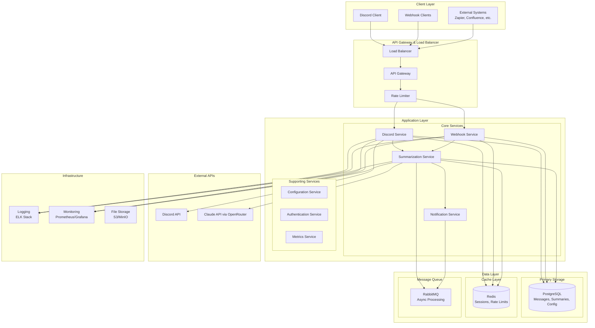
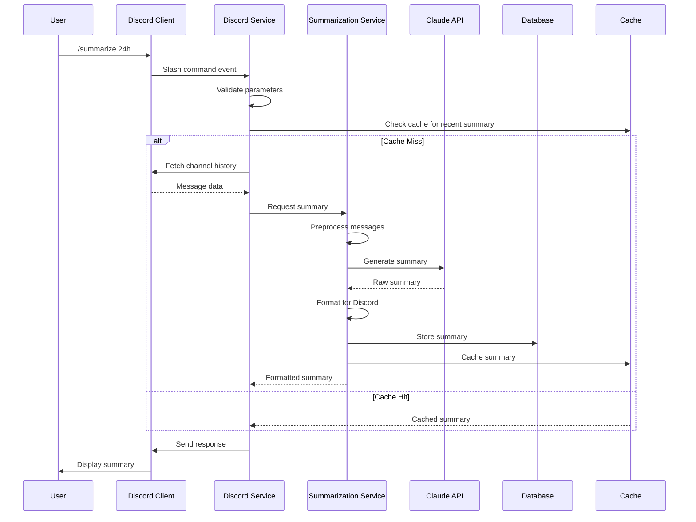
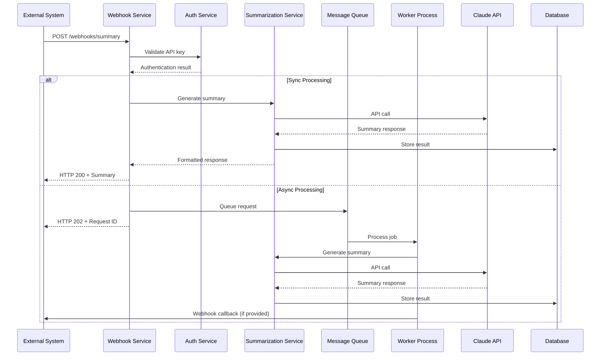

# Summary Bot NG - System Architecture

## 1. High-Level System Architecture



## 2. Component Architecture

### 2.1 Core Services

#### Discord Service
```python
# Responsibilities:
# - Discord bot lifecycle management
# - Slash command handling
# - Message event processing
# - Channel data retrieval

class DiscordService:
    def __init__(self, config: Config, summarization_service: SummarizationService):
        self.config = config
        self.summarization_service = summarization_service
        self.bot = commands.Bot()
    
    async def handle_slash_command(self, ctx: Context, command: str, **kwargs):
        """Process Discord slash commands"""
        pass
    
    async def fetch_channel_history(self, channel_id: str, time_range: TimeRange) -> List[Message]:
        """Retrieve messages from Discord channel"""
        pass
    
    async def send_response(self, ctx: Context, summary: Summary):
        """Send formatted response to Discord"""
        pass
```

#### Summarization Service
```python
# Responsibilities:
# - Message preprocessing and filtering
# - Claude API integration (via OpenRouter or direct)
# - Summary generation and formatting
# - Content caching

class SummarizationService:
    def __init__(self, llm_client: LLMClient, config: Config, cache: Cache):
        self.llm_client = llm_client
        self.config = config
        self.cache = cache
    
    async def summarize_messages(self, messages: List[Message], options: SummaryOptions) -> Summary:
        """Generate summary from Discord messages"""
        pass
    
    async def preprocess_messages(self, messages: List[Message]) -> List[ProcessedMessage]:
        """Filter and prepare messages for summarization"""
        pass
    
    async def format_summary(self, raw_summary: str, format_type: SummaryFormat) -> FormattedSummary:
        """Format summary for different output types"""
        pass
```

#### Webhook Service
```python
# Responsibilities:
# - REST API endpoint management
# - Webhook authentication
# - External system integration
# - Response formatting

class WebhookService:
    def __init__(self, summarization_service: SummarizationService, auth_service: AuthService):
        self.summarization_service = summarization_service
        self.auth_service = auth_service
    
    async def handle_webhook_request(self, request: WebhookRequest) -> WebhookResponse:
        """Process incoming webhook requests"""
        pass
    
    async def validate_request(self, request: WebhookRequest) -> bool:
        """Validate webhook authentication and parameters"""
        pass
    
    async def format_response(self, summary: Summary, format: OutputFormat) -> WebhookResponse:
        """Format response for external systems"""
        pass
```

### 2.2 Data Models

```python
from dataclasses import dataclass
from datetime import datetime
from typing import List, Optional
from enum import Enum

class SummaryFormat(Enum):
    DISCORD_EMBED = "discord_embed"
    MARKDOWN = "markdown"
    JSON = "json"
    PLAIN_TEXT = "plain_text"

class OutputFormat(Enum):
    JSON = "json"
    XML = "xml"
    MARKDOWN = "markdown"

@dataclass
class Message:
    id: str
    channel_id: str
    author_id: str
    author_name: str
    content: str
    timestamp: datetime
    attachments: List[str]
    embeds: List[dict]
    reactions: List[str]

@dataclass
class ProcessedMessage:
    original_message: Message
    filtered_content: str
    relevance_score: float
    technical_terms: List[str]

@dataclass
class SummaryOptions:
    time_range: 'TimeRange'
    channel_ids: List[str]
    include_technical_terms: bool = True
    include_decisions: bool = True
    max_length: int = 500
    format: SummaryFormat = SummaryFormat.DISCORD_EMBED

@dataclass
class Summary:
    id: str
    content: str
    technical_terms: List[str]
    key_decisions: List[str]
    message_count: int
    time_range: 'TimeRange'
    created_at: datetime
    format: SummaryFormat

@dataclass
class TimeRange:
    start: datetime
    end: datetime
    
    @classmethod
    def last_hours(cls, hours: int) -> 'TimeRange':
        end = datetime.utcnow()
        start = end - timedelta(hours=hours)
        return cls(start=start, end=end)
```

## 3. API Architecture

### 3.1 Discord Slash Commands

```yaml
discord_commands:
  - name: "summarize"
    description: "Generate a summary of channel messages"
    options:
      - name: "timeframe"
        type: "string"
        description: "Time period (1h, 4h, 24h, 7d)"
        required: true
        choices: ["1h", "4h", "12h", "24h", "7d"]
      
      - name: "channel"
        type: "channel"
        description: "Target channel (default: current)"
        required: false
      
      - name: "format"
        type: "string"
        description: "Output format"
        required: false
        choices: ["embed", "text", "detailed"]
        default: "embed"

  - name: "schedule"
    description: "Schedule automated summaries"
    options:
      - name: "frequency"
        type: "string"
        description: "Schedule frequency"
        required: true
        choices: ["daily", "weekly", "custom"]
      
      - name: "time"
        type: "string"
        description: "Time in HH:MM format (24h)"
        required: true
      
      - name: "channels"
        type: "string"
        description: "Comma-separated channel list"
        required: false
```

### 3.2 Webhook REST API

```yaml
openapi: 3.0.0
info:
  title: Summary Bot NG Webhook API
  version: 1.0.0
  description: REST API for external integrations

servers:
  - url: https://api.summarybot.example.com/v1
    description: Production
  - url: https://staging-api.summarybot.example.com/v1
    description: Staging

components:
  securitySchemes:
    bearerAuth:
      type: http
      scheme: bearer
      bearerFormat: JWT
    
    apiKey:
      type: apiKey
      in: header
      name: X-API-Key

paths:
  /webhooks/summary:
    post:
      summary: Generate summary via webhook
      operationId: createSummary
      tags: [Webhooks]
      security:
        - bearerAuth: []
        - apiKey: []
      requestBody:
        required: true
        content:
          application/json:
            schema:
              type: object
              required: [guild_id, channel_ids, time_range]
              properties:
                guild_id:
                  type: string
                  description: Discord guild ID
                channel_ids:
                  type: array
                  items:
                    type: string
                  description: List of Discord channel IDs
                time_range:
                  type: object
                  properties:
                    start:
                      type: string
                      format: date-time
                    end:
                      type: string
                      format: date-time
                output_format:
                  type: string
                  enum: [json, xml, markdown]
                  default: json
                webhook_url:
                  type: string
                  format: uri
                  description: Callback URL for async processing
      responses:
        200:
          description: Summary generated successfully
          content:
            application/json:
              schema:
                type: object
                properties:
                  summary_id:
                    type: string
                  summary:
                    $ref: '#/components/schemas/Summary'
        202:
          description: Request accepted for processing
          content:
            application/json:
              schema:
                type: object
                properties:
                  request_id:
                    type: string
                  status:
                    type: string
                    enum: [processing]
                  estimated_completion:
                    type: string
                    format: date-time

  /webhooks/status/{request_id}:
    get:
      summary: Check processing status
      operationId: getStatus
      tags: [Webhooks]
      security:
        - bearerAuth: []
        - apiKey: []
      parameters:
        - name: request_id
          in: path
          required: true
          schema:
            type: string
      responses:
        200:
          description: Status retrieved
          content:
            application/json:
              schema:
                type: object
                properties:
                  request_id:
                    type: string
                  status:
                    type: string
                    enum: [processing, completed, failed]
                  summary:
                    $ref: '#/components/schemas/Summary'
                  error:
                    type: string
```

## 4. Data Flow Architecture

### 4.1 Discord Command Flow



### 4.2 Webhook Processing Flow



## 5. Integration Patterns

### 5.1 External API Integration

```python
class ExternalAPIClient:
    """Base class for external API integrations"""
    
    def __init__(self, config: APIConfig):
        self.config = config
        self.session = aiohttp.ClientSession(
            timeout=aiohttp.ClientTimeout(total=30),
            connector=aiohttp.TCPConnector(limit=100)
        )
        self.rate_limiter = RateLimiter(
            calls=config.rate_limit.calls,
            period=config.rate_limit.period
        )
    
    async def make_request(self, method: str, url: str, **kwargs) -> dict:
        """Make rate-limited API request with retry logic"""
        async with self.rate_limiter:
            for attempt in range(3):
                try:
                    async with self.session.request(method, url, **kwargs) as response:
                        response.raise_for_status()
                        return await response.json()
                except aiohttp.ClientError as e:
                    if attempt == 2:  # Last attempt
                        raise
                    await asyncio.sleep(2 ** attempt)  # Exponential backoff

class DiscordAPIClient(ExternalAPIClient):
    """Discord API integration with proper rate limiting"""
    
    async def fetch_messages(self, channel_id: str, limit: int = 100, before: datetime = None) -> List[dict]:
        params = {"limit": limit}
        if before:
            params["before"] = int(before.timestamp() * 1000)
        
        return await self.make_request(
            "GET", 
            f"/channels/{channel_id}/messages",
            params=params,
            headers={"Authorization": f"Bot {self.config.token}"}
        )

class ClaudeClient(ExternalAPIClient):
    """Claude API integration via OpenRouter or direct Anthropic API"""

    async def create_completion(self, messages: List[dict], model: str = "anthropic/claude-3-sonnet-20240229") -> dict:
        # OpenRouter format
        if self.config.route == "openrouter":
            return await self.make_request(
                "POST",
                "/chat/completions",
                json={
                    "model": model,
                    "messages": messages,
                    "max_tokens": 1000,
                    "temperature": 0.3
                },
                headers={
                    "Authorization": f"Bearer {self.config.api_key}",
                    "Content-Type": "application/json"
                }
            )
        # Direct Anthropic API format
        else:
            return await self.make_request(
                "POST",
                "/v1/messages",
                json={
                    "model": model.replace("anthropic/", ""),
                    "messages": messages,
                    "max_tokens": 1000,
                    "temperature": 0.3
                },
                headers={
                    "x-api-key": self.config.api_key,
                    "anthropic-version": "2023-06-01",
                    "Content-Type": "application/json"
                }
            )
```

### 5.2 Event-Driven Architecture

```python
from abc import ABC, abstractmethod
from typing import Any, Dict

class Event:
    def __init__(self, event_type: str, data: Dict[str, Any], timestamp: datetime = None):
        self.event_type = event_type
        self.data = data
        self.timestamp = timestamp or datetime.utcnow()
        self.id = str(uuid.uuid4())

class EventHandler(ABC):
    @abstractmethod
    async def handle(self, event: Event) -> None:
        pass

class EventBus:
    def __init__(self):
        self.handlers: Dict[str, List[EventHandler]] = {}
    
    def subscribe(self, event_type: str, handler: EventHandler):
        if event_type not in self.handlers:
            self.handlers[event_type] = []
        self.handlers[event_type].append(handler)
    
    async def publish(self, event: Event):
        handlers = self.handlers.get(event.event_type, [])
        await asyncio.gather(*[handler.handle(event) for handler in handlers])

# Event handlers for different concerns
class SummaryCreatedHandler(EventHandler):
    async def handle(self, event: Event):
        # Send notifications, update metrics, etc.
        pass

class MessageProcessedHandler(EventHandler):
    async def handle(self, event: Event):
        # Update progress tracking, cache results, etc.
        pass
```